## Szétválasztás a fókuszban: Híd és Megfigyelő
### 1. **Híd (Bridge) tervezési minta**  
#### Értelmezés/felsorolás:  
- A Híd minta célja a különböző *Felületek* és *Megvalósítások* szétválasztása, miközben biztosítja azok rugalmas kombinációját.  
- Fő osztályok:  
  - **Felület** (absztrakt osztály) – Az absztrakció alapja, különböző konkrét *Felületek* ebből származnak.  
  - **Megvalósítás** (absztrakt osztály) – Az implementáció alapja, különböző konkrét *Megvalósítások* ebből származnak.  
  - **FelületA**, **FelületB** – A konkrét *Felületek*.  
  - **MegvalósításA**, **MegvalósításB** – A konkrét *Megvalósítások*.  
- Kapcsolatok:  
  - A *Felület* rendelkezik egy *Megvalósítás* példányával (*HAS-A* kapcsolat).  
  - A *Felület* és a *Megvalósítás* absztrakciója között nincsenek közvetlen kapcsolatok (*IS-A* kapcsolat).  

#### DIP vizsgálata:  
- **Minden nyíl absztrakcióra mutat?** Igen.  
- **Van olyan absztrakció, amelyre HAS-A és IS-A kapcsolat is mutat?** Igen, a *Megvalósítás* absztrakcióra.  
- **Ez az absztrakció szétválasztja a két oldalt?** Igen, ezáltal biztosítja a DIP elvét.  

#### UML PlantUML kód:  
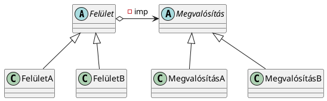

#### Példakód (Java):  
```java
abstract class Megvalósítás {
    abstract void művelet();
}

class MegvalósításA extends Megvalósítás {
    @Override
    void művelet() {
        System.out.println("Megvalósítás A");
    }
}

class MegvalósításB extends Megvalósítás {
    @Override
    void művelet() {
        System.out.println("Megvalósítás B");
    }
}

abstract class Felület {
    protected Megvalósítás megvalósítás;

    public Felület(Megvalósítás megvalósítás) {
        this.megvalósítás = megvalósítás;
    }

    abstract void működik();
}

class FelületA extends Felület {
    public FelületA(Megvalósítás megvalósítás) {
        super(megvalósítás);
    }

    @Override
    void működik() {
        System.out.print("Felület A: ");
        megvalósítás.művelet();
    }
}

class FelületB extends Felület {
    public FelületB(Megvalósítás megvalósítás) {
        super(megvalósítás);
    }

    @Override
    void működik() {
        System.out.print("Felület B: ");
        megvalósítás.művelet();
    }
}

public class Main {
    public static void main(String[] args) {
        Megvalósítás megvalA = new MegvalósításA();
        Felület felületA = new FelületA(megvalA);
        felületA.működik();

        Megvalósítás megvalB = new MegvalósításB();
        Felület felületB = new FelületB(megvalB);
        felületB.működik();
    }
}
```

---

### 2. **Megfigyelő (Observer) tervezési minta**  
#### Értelmezés/felsorolás:  
- Célja, hogy egy *Megfigyelt* objektum állapotának változásait automatikusan közölje a hozzá kapcsolódó *Megfigyelőkkel*.  
- Fő interfészek:  
  - **Megfigyelő** – Értesítéseket fogad.  
  - **Megfigyelt** – Megfigyelőket tartalmaz és értesíti őket változás esetén.  
- Kapcsolatok:  
  - Egy *Megfigyelt* objektumhoz több *Megfigyelő* kapcsolódhat (*0..n* kapcsolat).  
  - A *Megfigyelő* nem tud a *Megfigyelt* konkrét típusáról (csak az interfészről).  

#### DIP vizsgálata:  
- **Minden nyíl absztrakcióra mutat?** Igen.  
- **Van olyan absztrakció, amelyre HAS-A és IS-A kapcsolat is mutat?** Igen, a *Megfigyelő* interfész.  
- **Ez az absztrakció szétválasztja a két oldalt?** Igen, a *Megfigyelő* interfész biztosítja a DIP-t.  

#### UML PlantUML kód (Push változat):  
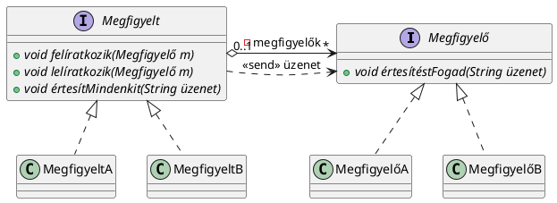

#### Példakód (Push változat, Java):  
```java
interface Megfigyelő {
    void értesítéstFogad(String üzenet);
}

interface Megfigyelt {
    void felíratkozik(Megfigyelő megfigyelő);
    void lelíratkozik(Megfigyelő megfigyelő);
    void értesítMindenkit(String üzenet);
}

class KonkrétMegfigyelt implements Megfigyelt {
    private List<Megfigyelő> megfigyelők = new ArrayList<>();

    @Override
    public void felíratkozik(Megfigyelő megfigyelő) {
        megfigyelők.add(megfigyelő);
    }

    @Override
    public void lelíratkozik(Megfigyelő megfigyelő) {
        megfigyelők.remove(megfigyelő);
    }

    @Override
    public void értesítMindenkit(String üzenet) {
        for (Megfigyelő m : megfigyelők) {
            m.értesítéstFogad(üzenet);
        }
    }
}

class KonkrétMegfigyelő implements Megfigyelő {
    private String név;

    public KonkrétMegfigyelő(String név) {
        this.név = név;
    }

    @Override
    public void értesítéstFogad(String üzenet) {
        System.out.println(név + " értesítést kapott: " + üzenet);
    }
}

public class Main {
    public static void main(String[] args) {
        Megfigyelt megfigyelt = new KonkrétMegfigyelt();
        Megfigyelő megfigyelő1 = new KonkrétMegfigyelő("Megfigyelő 1");
        Megfigyelő megfigyelő2 = new KonkrétMegfigyelő("Megfigyelő 2");

        megfigyelt.felíratkozik(megfigyelő1);
        megfigyelt.felíratkozik(megfigyelő2);

        megfigyelt.értesítMindenkit("Fontos esemény történt!");
    }
}
```

## Létrehozási tervezési minták
### Absztrakt gyár tervezési minta jegyzet

#### 1. Értelmezés és felsorolás
- **Lényege:** Az Absztrakt gyár minta lehetővé teszi, hogy egy közös témához tartozó objektumokat állítsunk elő anélkül, hogy azok konkrét implementációját specifikálnánk.
- **Működés:**
  - A gyár metódusai általában `create` prefixszel kezdődnek, hogy jelezzék: objektumot hoznak létre.
  - Különböző gyárak különböző termékeket hoznak létre, de a termékek kompatibilisek egymással gyáron belül.
  - A kliens kód dönti el, hogy melyik konkrét gyárat használja, majd az általános interfészen keresztül hoz létre objektumokat.
- **Használat célja:** Szétválasztja az objektumok implementációját azok használatától, és lehetővé teszi az egyszerű cserélhetőséget.

#### 2. DIP (Dependency Inversion Principle) elemzése
- **Kérdések vizsgálata:**
  - **Minden nyíl absztrakcióra mutat?**  
    Igen, a legtöbb kapcsolat absztrakcióra mutat, de a kliens kód esetében konkrét gyárakra is van asszociáció.
  - **Van absztrakció, amire HAS-A és IS-A kapcsolat is mutat?**  
    Igen, a `Product` és a `Factory` interfészek is ilyenek.
  - **Az absztrakció szétválasztja a két oldalt?**  
    Igen, a `Product` interfész elválasztja a konkrét gyárakat és termékeket egymástól.
- **Következtetés:**  
  Az Absztrakt gyár minta megfelel a DIP elveknek, hiszen az implementáció és a használat között egyértelmű absztrakciós réteg található.

#### 3. UML kód (PlantUML)
**Egyszerű változat:**
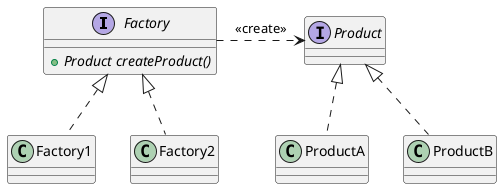

**Komplexebb változat:**
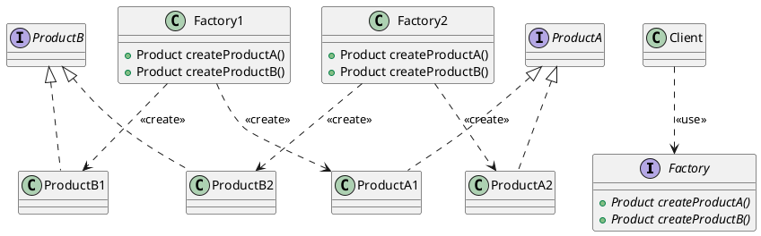

#### 4. Példakód (Java)
**Interfészek és implementációk:**
```java
// Termékek
interface Product {
    void use();
}

class ProductA1 implements Product {
    public void use() {
        System.out.println("Using ProductA1");
    }
}

class ProductB1 implements Product {
    public void use() {
        System.out.println("Using ProductB1");
    }
}

// Gyár interfész
interface Factory {
    Product createProductA();
    Product createProductB();
}

// Konkrét gyárak
class Factory1 implements Factory {
    public Product createProductA() {
        return new ProductA1();
    }
    public Product createProductB() {
        return new ProductB1();
    }
}

// Kliens kód
class Client {
    public static void main(String[] args) {
        Factory factory = new Factory1();
        Product productA = factory.createProductA();
        Product productB = factory.createProductB();

        productA.use();
        productB.use();
    }
}
```

Ez a kód példázza, hogy a kliens kód az absztrakt interfészekre támaszkodik, miközben a konkrét implementációkat dinamikusan állítja elő.


### 1. Értelmezés/felsorolásos szöveg

- **Építő (Builder) tervezési minta:** Segít az összetett objektumok létrehozásában, amelyeket lépésről lépésre, különböző módokon lehet felépíteni.
- **Absztrakciók:** Az Építő interfész segíti elválasztani a tervrajzot olvasó Mérnököt és a konkrét kivitelezést végző építőket.
- **Építő interfész:** Létrehozza a különböző építők osztályait (pl. KékÉpítő, PirosÉpítő), amelyek az építés lépéseit (setA, setB) biztosítják.
- **Metódusok és láncolás:** Az építők metódusai láncolhatóak (pl. `new KékÉpítő().setA(a).setB(b).getResult();`), lehetővé téve a folyamat lépésről lépésre történő végrehajtását.
- **Legkisebb Tudás Elve (Law of Demeter):** A láncolt metódushívások nem sértik a legkisebb tudás elvét, mivel a metódusok egyazon osztályon belül maradnak.
- **Kovariáns visszatérési típusok:** A gyermekosztályok a szülőosztály típusától eltérő visszatérési típusokat is használhatnak.
- **Párhuzamos osztályhierarchia:** Ha az Építő minta több párhuzamos osztályhierarchiát eredményez, az hibát jelezhet, de nem minden esetben javítható. Például, ha nem lehet örökölni egy PDF dokumentumból, külön osztályt kell létrehozni a PDFÉpítő számára.

### 2. DIP / Nem DIP kérdés vizsgálata
- **DIP:** Az Építő interfész elválasztja a mérnököt a konkrét építőktől. A mérnök a tervrajzot használva határozza meg a lépéseket, de nem tudja, hogyan kell végrehajtani őket. A konkrét építő végzi a kivitelezést.
- **Nem DIP:** Ha a tervezés során párhuzamos osztályhierarchia jön létre, az nem felel meg a DIP-nek. Ilyen esetekben a hierarchiák összevonása vagy más megoldások alkalmazása szükséges.

### 3. UML kód a szövegből
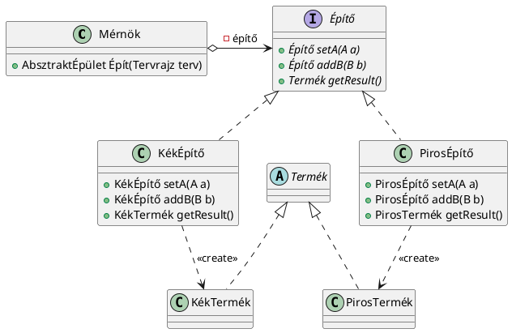

### 4. Példakód
```java
public class Main {
    public static void main(String[] args) {
        A a = new A();
        B b = new B();
        
        // KékÉpítő használata
        KékÉpítő kékÉpítő = new KékÉpítő();
        KékTermék kékTermék = kékÉpítő.setA(a).addB(b).getResult();
        
        // PirosÉpítő használata
        PirosÉpítő pirosÉpítő = new PirosÉpítő();
        PirosTermék pirosTermék = pirosÉpítő.setA(a).addB(b).getResult();
        
        System.out.println("Kék termék: " + kékTermék);
        System.out.println("Piros termék: " + pirosTermék);
    }
}
```

1. **Értelmezés/felsorolásos szöveg**:
   - A **Prototípus** tervezési minta célja, hogy egy meglévő objektumot másoljon le és az új példányt módosítja, hogy megfeleljen a különböző igényeknek.
   - Az **UML ábra** alapján a Prototípus minta bemutatja, hogyan hozhatunk létre egy másolatot a termék prototípusából.
   - Az **absztrakciók** szerepe:
     - A **Cloneable** interfész biztosítja a másolhatóságot a clone() metódussal.
     - A **TermékGyár** osztály tartalmaz egy prototípus referenciát, ami egy konkrét Termék példány.
     - A **Termék** osztály implementálja a Cloneable interfészt, tehát képes másolatot készíteni saját magáról.
   - A Prototípus minta nem teljesen követi a **Dependency Inversion Principle (DIP)** elvet, mivel a TermékGyár konkrétan egy **Termék** osztályt használ. Az ideális esetben a Termék interfészként vagy absztrakt osztályként lenne jelen.
   - **DIP bevezetése**: Ha a Termék interfész vagy absztrakt osztály lenne, akkor a TermékGyár és a Termék osztály közötti kapcsolat **DIP**-et alkalmazna.
   - A második UML ábra a **SzínezhetőKlonozható** interfész bevezetésével segít elválasztani a TermékGyárat a konkrét Termékektől, így biztosítva a DIP elvet.
   - **DIP viták**: A Prototípus minta tervezése során vita alakulhat ki a csapatban, hogy mikor és hogyan kell alkalmazni a DIP elvet. A vezető fejlesztő és a tervező különböző megközelítéseket alkalmazhatnak.

2. **DIP/ nem DIP kérdés vizsgálata**:
   - **Nem DIP**: Az első ábrán a TermékGyár közvetlenül hivatkozik a Termék osztályra, ami nem felel meg a DIP elvnek. A TermékGyár konkrét osztályokat használ, nem absztrakt osztályokat vagy interfészeket.
   - **DIP**: A második UML ábrán a SzínezhetőKlonozható interfész használata lehetővé teszi a DIP alkalmazását, mivel a TermékGyár nem közvetlenül a konkrét termékekre hivatkozik, hanem az absztrakt interfészre.

3. **UML kód a szövegből**:

   - Az első UML kód (nem DIP):
     ```plantuml
     @startuml
     interface Cloneable {
     +{abstract} Object clone()
     }
     class TermékGyár {
     -Termék prototípus
     +TermékGyár(Termék prototípus)
     +Termék gyárt(A a)
     }
     class Termék {
     +void setA(A a)
     +Termék clone()
     }
     note right of TermékGyár::gyárt
     Termék újTermék = prototípus.clone();
     újTermék.setA(a);
     return újTermék;
     end note
     TermékGyár o-left-> Termék : -prototípus
     TermékGyár ..> Cloneable : <<use>>
     Termék .up.|> Cloneable
     @enduml
     ```

   - A második UML kód (DIP):
     ```plantuml
     @startuml
     interface Cloneable {
     +{abstract} Object clone()
     }
     interface Színezhető {
     +{abstract} void setSzín(Szín szín)
     }
     interface SzínezhetőKlonozható {
     }
     class TermékA {}
     class TermékB {}
     class TermékGyár {
     -SzínezhetőKlonozható prototípus
     +TermékGyár(SzínezhetőKlonozható prototípus)
     +SzínezhetőKlonozható gyárt(Szín szín)
     }
     note top of TermékGyár
     public SzínezhetőKlonozható gyárt(Szín szín) {
     SzínezhetőKlonozható újTermék = prototípus.clone();
     újTermék.setSzín(szín);
     return újTermék;
     }
     end note
     TermékGyár o-left-> SzínezhetőKlonozható : -prototípus
     SzínezhetőKlonozható .up.|> Cloneable
     SzínezhetőKlonozható .up.|> Színezhető
     SzínezhetőKlonozható <|.. TermékA
     SzínezhetőKlonozható <|.. TermékB
     @enduml
     ```

4. **Példakód**:
   - Az alábbi példa kód bemutatja a Prototípus minta egyszerű implementációját:
     ```java
     // Cloneable interfész
     public interface Cloneable {
         Object clone();
     }

     // Termék osztály, ami implementálja a Cloneable interfészt
     public class Termék implements Cloneable {
         private String name;

         public Termék(String name) {
             this.name = name;
         }

         @Override
         public Object clone() {
             return new Termék(this.name);
         }

         public String getName() {
             return name;
         }

         public void setName(String name) {
             this.name = name;
         }
     }

     // TermékGyár osztály
     public class TermékGyár {
         private Termék prototípus;

         public TermékGyár(Termék prototípus) {
             this.prototípus = prototípus;
         }

         public Termék gyárt(String name) {
             Termék újTermék = (Termék) prototípus.clone();
             újTermék.setName(name);
             return újTermék;
         }
     }

     public class Main {
         public static void main(String[] args) {
             Termék prototípus = new Termék("Alap Termék");
             TermékGyár gyár = new TermékGyár(prototípus);

             // Egy új termék gyártása
             Termék újTermék = gyár.gyárt("Új Termék");
             System.out.println(újTermék.getName());  // Kiírja: Új Termék
         }
     }
     ```

## Szerkezeti tervezési minták

### 1. Értelmezés/Felsorolásos szöveg

**Díszítő (Decorator) Tervezési Minta:**
- A Díszítő minta lehetővé teszi, hogy egy objektumot dinamikusan bővítsünk új funkciókkal, anélkül hogy módosítanánk a meglévő objektumok kódját.
- A minta általában egy absztrakt osztályt (pl. KarácsonyFa) és egy sor "díszítő" osztályt tartalmaz (pl. GömbDísz, CsillagDísz).
- A díszítő osztályok olyan objektumokat kapsznak paraméterül, melyek ugyanazon absztrakt osztályból származnak, majd hozzáadnak új funkcionalitásokat.
- A példában a `getÁr()` metódus minden díszítésnél az alap objektum (pl. LucFenyő) árát növeli a dísz árának megfelelően.
- Az absztrakt osztály és annak alosztályai közötti kapcsolat nem változtatja meg az objektumok típusait, hanem azokat dinamikusan bővíti.
- **Teleszkópos konstruktor** jelenség: Ahogy egyre több díszítő réteget adunk hozzá, a konstruktor hívás egyre hosszabbá válik (pl. `new GömbDísz(new CsillagDísz(new LucFenyő()))`).

**Összetétel (Composite) Tervezési Minta:**
- Az Összetétel minta azt lehetővé teszi, hogy egy objektumot összetett objektumokká építsünk, ahol az összetevők egy-egy objektumot vagy más összetevőket tartalmaznak.
- Az összetevő osztályok (pl. Ág, Levél) ugyanabból az absztrakt osztályból származnak (pl. Összetétel), és tartalmazhatnak más összetevőket, így képesek rekurzívan kezelni a struktúrát.

### 2. DIP/Nem DIP kérdés vizsgálata

- **DIP (Dependency Inversion Principle) érvényesülése:**
  - A KarácsonyFa absztrakt osztály és annak alosztályai (pl. LucFenyő) biztosítják, hogy a Kliens ne közvetlenül egy konkrét implementációt használjon.
  - A Kliens számára a Díszítő mintázat segítségével a KarácsonyFa absztrakciója biztosítja a függetlenséget, tehát a Kliens nem függ a konkrét implementációktól.
  - Azonban a "teleszkópos konstruktor" problémája is felmerül, mivel ahogy a dekorátorok száma növekszik, úgy a kód egyre bonyolultabbá válik, ami a DIP szempontjából nehezíti a karbantartást.

- **Nem DIP:**
  - A KarácsonyFa és a Dísz osztály között IS-A és HAS-A kapcsolatok is létrejönnek, és a "diszítendő" kapcsolat részleteiben nem alkalmazunk szoros elválasztást.
  - Ha a Kliens oldalát nem vizsgáljuk, nem vesszük észre, hogy az egyre bonyolultabb konstruktor hívások miatt a DIP sérülhet.

### 3. UML kód a szövegből

**Díszítő tervezési minta UML ábrája:**
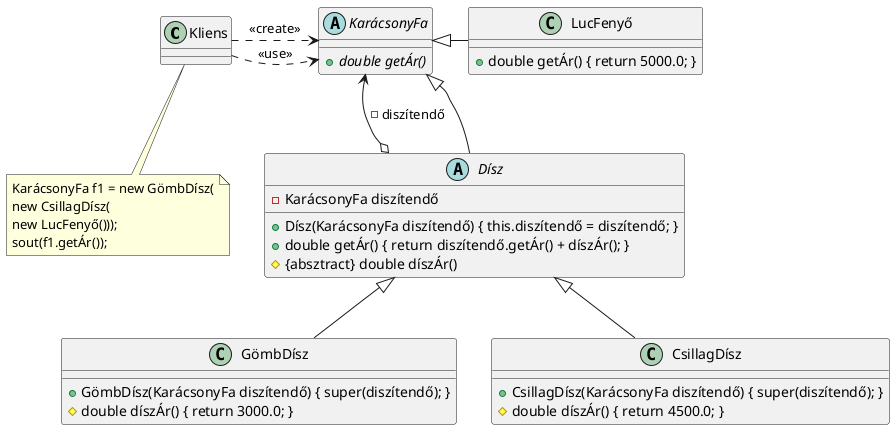

**Összetétel tervezési minta UML ábrája:**
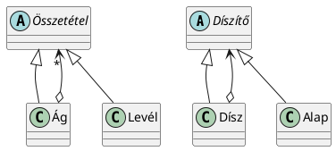

### 4. Példakód

**Díszítő minta példakód:**
```java
// A fa létrehozása díszítésekkel
KarácsonyFa f1 = new GömbDísz(new CsillagDísz(new LucFenyő()));
System.out.println(f1.getÁr()); // Kiszámolja az árát: 5000 + 4500 + 3000 = 12500
```

**Összetétel minta példakód:**
```java
// Az Összetétel minta használata
Összetétel fa = new Ág();
fa.add(new Levél());
fa.add(new Ág());
fa.add(new Levél());
```

Ezek a példák és magyarázatok segítenek abban, hogy jobban megértsük a Díszítő és az Összetétel tervezési minták használatát és alkalmazását, valamint azok előnyeit és hátrányait a programozási gyakorlatban.

### 1. Értelmezés/felsorolásos szöveg:

A Pehelysúlyú (Flyweight) tervezési minta célja, hogy minimalizálja az objektumok memóriahasználatát azáltal, hogy a közös állapotokat megosztja a különböző objektumok között. Ez különösen akkor hasznos, ha sok azonos típusú objektumot kell kezelni, de ezek közül soknak csak a különböző külső állapotai térnek el egymástól. A minta az állapotokat két kategóriába osztja:

- **Belső állapot**: Olyan információ, amely minden objektumnál azonos és megosztható.
- **Külső állapot**: Olyan információ, amely változó és a környezetből származik, nem tárolható meg minden objektumban.

A tervezési minta kombinálja a **Többke** és **Felelősséglánc** mintákat. A **Többke** biztosítja, hogy egy állapot csak egyszer kerüljön tárolásra, míg a **Felelősséglánc** tárolja a külső állapotot és kezeli a színt.

### 2. DIP / nem DIP kérdés vizsgálata:

- **DIP (Dependency Inversion Principle)**: A minta **DIP**-t követ, mivel a **Pehelysúlyú** osztály nem függ közvetlenül a konkrét külső állapotoktól, hanem az **KülsőÁllapot** interfészt használja. Ezáltal a belső állapotot és a külső állapotot külön kezeli.
- A **KülsőÁllapot** interfész biztosítja az absztrakciót, amely szétválasztja a belső és külső állapotokat, így biztosítva a kód flexibilitását és újrafelhasználhatóságát.
- A gyár **Pehelysúlyú** osztályra mutató nyílja nem jelenti azt, hogy a Pehelysúlyú osztály absztrakt lenne, de még mindig **DIP** elveken alapul, mivel a külső állapotokat az interfész segítségével választjuk el.

### 3. UML kód a szövegből:

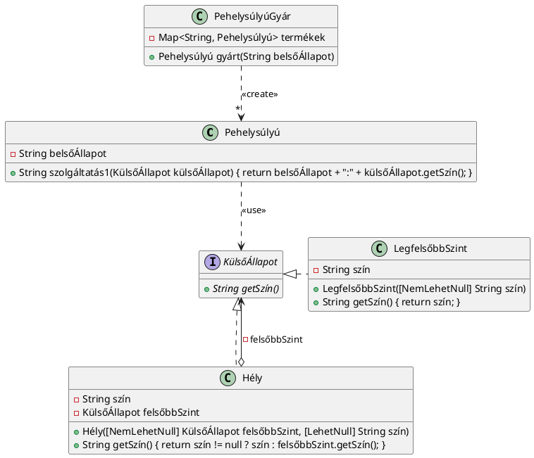

### 4. Példakód:

```java
// Pehelysúlyú osztály
class Pehelysúlyú {
    private String belsőÁllapot;

    public String szolgáltatás1(KülsőÁllapot külsőÁllapot) {
        return belsőÁllapot + ":" + külsőÁllapot.getSzín();
    }
}

// Gyár osztály
class PehelysúlyúGyár {
    private Map<String, Pehelysúlyú> termékek = new HashMap<>();

    public Pehelysúlyú gyárt(String belsőÁllapot) {
        if (!termékek.containsKey(belsőÁllapot)) {
            termékek.put(belsőÁllapot, new Pehelysúlyú(belsőÁllapot));
        }
        return termékek.get(belsőÁllapot);
    }
}

// Külső állapot interfész
interface KülsőÁllapot {
    String getSzín();
}

// Hély osztály, amely megvalósítja a KülsőÁllapot interfészt
class Hély implements KülsőÁllapot {
    private String szín;
    private KülsőÁllapot felsőbbSzint;

    public Hély(KülsőÁllapot felsőbbSzint, String szín) {
        this.felsőbbSzint = felsőbbSzint;
        this.szín = szín;
    }

    @Override
    public String getSzín() {
        return szín != null ? szín : felsőbbSzint.getSzín();
    }
}

// LegfelsőbbSzint osztály, amely szintén megvalósítja a KülsőÁllapot interfészt
class LegfelsőbbSzint implements KülsőÁllapot {
    private String szín;

    public LegfelsőbbSzint(String szín) {
        this.szín = szín;
    }

    @Override
    public String getSzín() {
        return szín;
    }
}
```

**1. Értelmezés/Felsorolásos szöveg:**

A Helyettes (Proxy) tervezési minta a következő tulajdonságokkal rendelkezik:

- A helyettes osztály (Proxy) egy olyan osztály, amely egy másik osztály, az ÉrtékesEntitás példányát reprezentálja és hozzáférést biztosít annak szolgáltatásaihoz.
- A Proxy osztály biztosítja az ÉrtékesEntitás példányosítását, ha még nem történt meg (lazy initialization), így a tényleges objektumot nem hozzák létre a kliens oldalon közvetlenül.
- A KözösFelület interfész egy absztrakciót biztosít, amelyen keresztül mind a Proxy, mind az ÉrtékesEntitás osztályok szolgáltatásai elérhetők.
- A Proxy biztosítja, hogy a kliens csak a Proxy osztályon keresztül férhet hozzá az ÉrtékesEntitás objektumhoz.
- Az ÉrtékesEntitás osztály csomag privát láthatóságot kap, így a kliens nem férhet hozzá közvetlenül, csak a Proxy segítségével.

**2. DIP/Nem DIP kérdés vizsgálata:**

- A KözösFelület interfész egy absztrakció, amelyen keresztül a kliens és az ÉrtékesEntitás kapcsolódik, így ez egy **DIP** (Dependency Inversion Principle) példa.
- A kliens nem közvetlenül az ÉrtékesEntitás osztályra van támaszkodva, hanem a Proxy osztályon keresztül, amely az ÉrtékesEntitás objektumot valósítja meg.
- Az absztrakció szétválasztja a két oldalt, mivel a kliens a Proxy osztályon keresztül fér hozzá az ÉrtékesEntitás objektumhoz, így ez is **DIP**.

**3. UML kód a szövegből:**

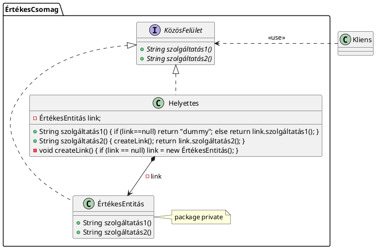

**4. Példakód:**

```java
// KözösFelület interfész
public interface KözösFelület {
    String szolgáltatás1();
    String szolgáltatás2();
}

// Helyettes osztály (Proxy)
public class Helyettes implements KözösFelület {
    private ÉrtékesEntitás link;

    @Override
    public String szolgáltatás1() {
        if (link == null) {
            return "dummy";
        } else {
            return link.szolgáltatás1();
        }
    }

    @Override
    public String szolgáltatás2() {
        createLink();
        return link.szolgáltatás2();
    }

    private void createLink() {
        if (link == null) {
            link = new ÉrtékesEntitás();
        }
    }
}

// ÉrtékesEntitás osztály
public class ÉrtékesEntitás implements KözösFelület {
    @Override
    public String szolgáltatás1() {
        return "ÉrtékesEntitás szolgáltatás1";
    }

    @Override
    public String szolgáltatás2() {
        return "ÉrtékesEntitás szolgáltatás2";
    }
}

// Kliens osztály
public class Kliens {
    public static void main(String[] args) {
        KözösFelület helyettes = new Helyettes();
        System.out.println(helyettes.szolgáltatás1()); // "dummy"
        System.out.println(helyettes.szolgáltatás2()); // "ÉrtékesEntitás szolgáltatás2"
    }
}
```

Ebben a példában a Kliens osztály csak a Proxy osztály (Helyettes) szolgáltatásait hívja meg, nem fér hozzá közvetlenül az ÉrtékesEntitás objektumhoz. Az ÉrtékesEntitás objektum csak akkor példányosodik, amikor szükség van rá a Proxy osztályban.

## Viselkedési tervezési minták

### 1. Értelmezés/Felsorolásos Szöveg:
- A **Felelősséglánc** (angolul: Chain-of-Responsibility) tervezési minta célja, hogy egy kérés több kezelőn keresztül kerül feldolgozásra, és minden kezelő eldöntheti, hogy képes-e válaszolni, vagy továbbpasszolja a következő kezelőnek.
- A láncban minden egyes elem egy külön-külön osztály, amelyek saját logikájukkal dönthetik el, hogy képesek-e válaszolni a kérésre.
- A láncban történő továbbadás a **"következő"** referencia segítségével történik, és minden láncszem a Felelősséglánc absztrakt osztályt implementálja.
- A Felelősséglánc absztrakt osztály tartalmazza a közös logikát és a következő láncszemhez való irányítást, de nem tartalmaz konkrét kéréskezelést.
- A minta alkalmazásával a felelősségek szétválaszthatóak, és a kérések kezelése rugalmasan bővíthető.
- A Felelősséglánc mintát akkor alkalmazhatjuk, ha egy kérésnek több lehetséges kezelése van, és nem biztos, hogy az összes láncszem képes megválaszolni azt. Az is előfordulhat, hogy a válasz csak részben készül el, így a láncon való továbbításra van szükség.

### 2. DIP/Nem DIP Kérdés Vizsgálata:
- **Igen, ez egy DIP**! A minta alkalmazásával szétválasztjuk a kérést összeállító és a választ váró részt a felelősséglánctól, amely a kérés megválaszolására képes. A láncszemek külön osztályokban vannak elhelyezve, így a másik oldal nem ismeri ezeket, és nem kell a konkrét megvalósítást ismernie, csak a közös interfészt.
- A lánc kezelését biztosító osztályok nem igénylik a felelősségek pontos ismeretét, csak az absztrakt Felelősséglánc interfészt, amely lehetővé teszi, hogy a kérés végigmenjen a láncon anélkül, hogy bármelyik kezelő konkrét implementációját ismerné.

### 3. UML Kód a Szövegből:
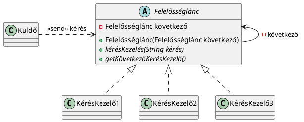

### 4. Példakód:
```java
// Absztrakt Felelősséglánc osztály
abstract class Felelősséglánc {
    protected Felelősséglánc következő;

    public Felelősséglánc(Felelősséglánc következő) {
        this.következő = következő;
    }

    public abstract void kérésKezelés(String kérés);

    public Felelősséglánc getKövetkezőKérésKezelő() {
        return következő;
    }
}

// KérésKezelő1 osztály
class KérésKezelő1 extends Felelősséglánc {
    public KérésKezelő1(Felelősséglánc következő) {
        super(következő);
    }

    @Override
    public void kérésKezelés(String kérés) {
        if (kérés.contains("fordítás")) {
            System.out.println("KérésKezelő1: Kérés feldolgozása");
        } else if (következő != null) {
            következő.kérésKezelés(kérés);
        }
    }
}

// KérésKezelő2 osztály
class KérésKezelő2 extends Felelősséglánc {
    public KérésKezelő2(Felelősséglánc következő) {
        super(következő);
    }

    @Override
    public void kérésKezelés(String kérés) {
        if (kérés.contains("vers")) {
            System.out.println("KérésKezelő2: Vers fordítása");
        } else if (következő != null) {
            következő.kérésKezelés(kérés);
        }
    }
}

// KérésKezelő3 osztály
class KérésKezelő3 extends Felelősséglánc {
    public KérésKezelő3(Felelősséglánc következő) {
        super(következő);
    }

    @Override
    public void kérésKezelés(String kérés) {
        if (kérés.contains("latin")) {
            System.out.println("KérésKezelő3: Latin kifejezések kezelése");
        } else if (következő != null) {
            következő.kérésKezelés(kérés);
        }
    }
}

// Tesztelés
public class Main {
    public static void main(String[] args) {
        Felelősséglánc lánc = new KérésKezelő1(new KérésKezelő2(new KérésKezelő3(null)));
        lánc.kérésKezelés("fordítás vers latin");
    }
}
```
A fenti példakódban három láncszem található (KérésKezelő1, KérésKezelő2, KérésKezelő3), és minden láncszem eldönti, hogy képes-e feldolgozni a kérést, vagy továbbadja a láncon.
### 1. Értelmezés / Felsorolásos szöveg

- **Parancs (Command) tervezési minta**: A minta lehetővé teszi a metódushívások leválasztását a konkrét implementációkról. A Parancs minta lényege, hogy egy objektumba csomagol egy műveletet (parancs), amelyet később bárhol, bármikor végrehajthatunk.
- **Felhasználás**: A Parancs minta akkor hasznos, amikor ugyanazt az algoritmust különböző helyekről (például gombnyomás, billentyűkombináció, időzítés) akarjuk végrehajtani, és egységesen szeretnénk kezelni.
- **Paraméterek kezelése**: A minta lehetőséget biztosít arra, hogy az algoritmus paraméterei előre fixálhatóak, de késlekedés is lehetséges. Ha a paraméterek már a hívás előtt ismertek, akkor nem szükséges paramétereket átadni a `végrehajt` metódusnak.
- **Szétválasztás**: A Parancs minta segít szétválasztani a hívást és a végrehajtást. A Hívó osztály az egyik oldalon, míg a Hívott osztály a másikon található. A két osztály között egy közvetítő, a Feldolgozó található, amely a parancsot végrehajtja.

### 2. DIP / Nem DIP kérdés vizsgálata

- **DIP alkalmazása**: A tervezési minta a **Dependency Inversion Principle (DIP)** elvét követi, mivel a **Parancs interfész** szétválasztja a Hívó és Hívott osztályokat. A Hívó és a Hívott osztályok nincsenek közvetlen kapcsolatban, hanem a **Feldolgozó** hívja meg a Parancs objektum `végrehajt()` metódusát. 
- **Absztrakciók közötti kapcsolat**: A Parancs interfészhez kétféle kapcsolat is vezethet: 
  - A Hívó osztály konkrét példányokkal kommunikál, tehát nem absztrakcióra mutat.
  - A Hívó osztály és a Hívott osztály közötti kapcsolat a Feldolgozón keresztül van biztosítva, tehát a feldolgozó felelős a parancsok végrehajtásáért, ezáltal az absztrakciók elválnak.

### 3. UML kód a szövegből

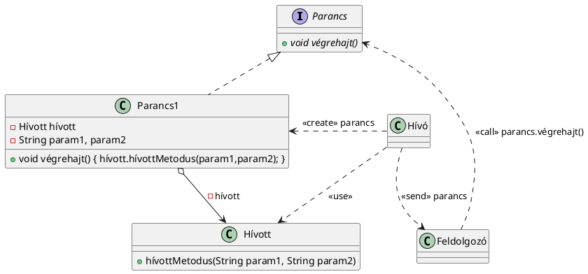

### 4. Példakód

```java
// Parancs interfész
public interface Parancs {
    void végrehajt();
}

// Hívott osztály, amely végrehajtja a parancsot
public class Hívott {
    public void hívottMetodus(String param1, String param2) {
        System.out.println("Parancs végrehajtása: " + param1 + ", " + param2);
    }
}

// Parancs1 osztály, amely a parancsot tartalmazza
public class Parancs1 implements Parancs {
    private Hívott hívott;
    private String param1, param2;

    public Parancs1(Hívott hívott, String param1, String param2) {
        this.hívott = hívott;
        this.param1 = param1;
        this.param2 = param2;
    }

    @Override
    public void végrehajt() {
        hívott.hívottMetodus(param1, param2);
    }
}

// Feldolgozó osztály, amely a parancsokat végrehajtja
public class Feldolgozó {
    public void végrehajtParancs(Parancs parancs) {
        parancs.végrehajt();
    }
}

// Tesztelő kód
public class Main {
    public static void main(String[] args) {
        Hívott hívott = new Hívott();
        Parancs parancs = new Parancs1(hívott, "param1", "param2");
        Feldolgozó feldolgozó = new Feldolgozó();
        feldolgozó.végrehajtParancs(parancs);
    }
}
```

Ez a kód bemutatja a Parancs tervezési minta alkalmazását, ahol a `Hívott` osztály hajtja végre a metódust, a `Parancs1` tartalmazza a parancsot, és a `Feldolgozó` osztály hívja meg a parancsot a végrehajtás érdekében.

**8.4.3. Értelmező (Interpreter) Tervezési Minta**

1. **Értelmezés/Felsorolásos szöveg:**
   - Az **Értelmező** (Interpreter) tervezési minta a **Domain Specific Language (DSL)** típusú nyelvek létrehozására és felhasználására szolgál.
   - A minta a **Fordító programok** (compiler) világába tartozik, és segít a programok nyelvi elemeinek értelmezésében.
   - A minta célja, hogy egy szintaxis elemzésével egy adott nyelvet értelmezzünk, és végrehajtsunk rajta valamilyen műveletet.
   - Az Értelmező minta működésének kulcsa, hogy **Kifejezés** interfész segítségével definiálja az értelmezést. A **Kliens** a **Kifejezés** interfészen keresztül képes használni a DSL-t.
   - A **Terminális** és **NemTerminális** osztályok különböző típusú kifejezéseket képviselnek, ahol a **NemTerminális** típusú kifejezés több operandust tartalmazhat.
   - A **Kontextus** osztály segít az értelmezés során, mivel a kifejezések végrehajtásához szükséges környezeti adatokat tárolja.

2. **DIP/Nem DIP kérdés vizsgálata:**
   - **DIP (Dependency Inversion Principle)**: Az Értelmező tervezési minta elválasztja a **Kliens** és a **DSL** között a szintaxis (Kifejezés) szintjét. A **Kliens** tudja, hogyan épülnek fel a DSL mondatok, de nem kell tudnia azok jelentéséről. Ezért a **Kliens** csak a **Kifejezés** interfészhez kapcsolódik, míg a DSL implementációja rejtve marad előle.
   - A **Kliens** tehát a **Kifejezés** interfészhez kapcsolódik, de a DSL megvalósításával kapcsolatosan nem rendelkezik közvetlen információval. Ez egy **DIP**, mivel a kliens nem a konkrét implementációra támaszkodik, hanem az absztrakcióra.

3. **UML Kód a szövegből:**
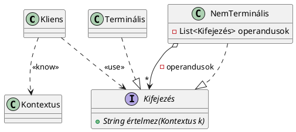

4. **Példakód:**
```java
// Kifejezés interface
interface Kifejezés {
    String értelmez(Kontextus k);
}

// Terminális kifejezés
class Terminális implements Kifejezés {
    private String érték;

    public Terminális(String érték) {
        this.érték = érték;
    }

    @Override
    public String értelmez(Kontextus k) {
        // A terminális kifejezés egyszerűen visszaadja az értékét
        return this.érték;
    }
}

// NemTerminális kifejezés, amely operandusokat tartalmaz
class NemTerminális implements Kifejezés {
    private List<Kifejezés> operandusok;

    public NemTerminális() {
        operandusok = new ArrayList<>();
    }

    public void hozzáad(Kifejezés kifejezés) {
        operandusok.add(kifejezés);
    }

    @Override
    public String értelmez(Kontextus k) {
        StringBuilder eredmény = new StringBuilder();
        for (Kifejezés operandus : operandusok) {
            eredmény.append(operandus.értelmez(k)).append(" ");
        }
        return eredmény.toString().trim();
    }
}

// Kontextus osztály, amely segíti az értelmezést
class Kontextus {
    // Kontextus specifikus adatok
}

// Kliens osztály, amely használja a kifejezéseket
class Kliens {
    private Kifejezés kifejezés;

    public Kliens(Kifejezés kifejezés) {
        this.kifejezés = kifejezés;
    }

    public void értelmez(Kontextus k) {
        System.out.println("Értelmezés eredménye: " + kifejezés.értelmez(k));
    }
}

// Tesztelés
public class Main {
    public static void main(String[] args) {
        Kliens kliens = new Kliens(new NemTerminális());
        Kontextus kontextus = new Kontextus();
        
        Terminális t1 = new Terminális("5");
        Terminális t2 = new Terminális("3");
        
        NemTerminális n1 = new NemTerminális();
        n1.hozzáad(t1);
        n1.hozzáad(t2);
        
        kliens.értelmez(kontextus); // Kiírja az értelmezett kifejezés eredményét
    }
}
```

Ebben a példában az `Értelmező` tervezési minta bemutatásra kerül egy egyszerű kifejezésértelmező programban, ahol a `Kliens` a `Kifejezés` interfészen keresztül használja a kifejezéseket, és a `Kontextus` biztosítja az értelmezéshez szükséges adatokat.

### 1. Értelmezés/felsorolásos szöveg:
- **Iterátor (Iterator)**: A tervezési minta arra szolgál, hogy a konténer objektumok elemeit külső kódok, például kliensek, egyszerűsített módon, iteratívan (például `while` ciklusban) feldolgozhassák anélkül, hogy tudnának az adatstruktúra részleteiről.
- A minta két alapvető metódust tartalmaz:
  - `next()`: A következő elemet adja vissza.
  - `hasNext()`: Megmondja, hogy van-e még következő elem.
- **Jellemzők**:
  - Az iterátort használó osztályok (például a `Kliens` és `AutóKonténer`) nem tudják, hogy mi történik a konténerben, csak az iterátor szolgáltatásait használják.
  - Az **Iterator<T>** interfész szétválasztja a kliens kódot és a konténer implementációját, ami követi a **Dependency Inversion Principle (DIP)**-t.
- A minta széles körben használt a modern OOP nyelvekben, és beépült a legtöbb **Collection** típusba, mint például **List**, **Queue**, és **Set**.

### 2. DIP / Nem DIP kérdés vizsgálata:
- Az **Iterator<T>** interfész a DIP elvét követi, mivel:
  - Az iterátor interfész és a konténer osztályok (mint az `AutóKonténer`) absztrakciót biztosítanak.
  - A kliens osztályok (mint a `Kliens`) nem tudják, hogyan van implementálva a konténer, csak az iterátort használják.
  - A kliens osztályok számára a konténer osztályok részletei elrejtve vannak, így azok könnyen cserélhetők vagy módosíthatók anélkül, hogy a kliens kódot érintené.

### 3. UML kód a szövegből:
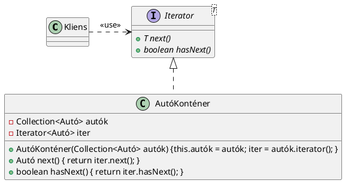

### 4. Példakód:
```java
import java.util.*;

class Autó {
    String márka;
    public Autó(String márka) {
        this.márka = márka;
    }
    public String getMárka() {
        return márka;
    }
}

class AutóKonténer implements Iterator<Autó> {
    private Collection<Autó> autók;
    private Iterator<Autó> iter;
    
    public AutóKonténer(Collection<Autó> autók) {
        this.autók = autók;
        this.iter = autók.iterator();
    }
    
    @Override
    public boolean hasNext() {
        return iter.hasNext();
    }
    
    @Override
    public Autó next() {
        return iter.next();
    }
}

public class Main {
    public static void main(String[] args) {
        Collection<Autó> autók = Arrays.asList(new Autó("BMW"), new Autó("Audi"), new Autó("Mercedes"));
        AutóKonténer konténer = new AutóKonténer(autók);
        
        while (konténer.hasNext()) {
            System.out.println(konténer.next().getMárka());
        }
    }
}
```

### További megjegyzés:
- Az iterátor minta segít abban, hogy a kliens kód független maradjon az adatszerkezet implementációjától, és az elemek egyszerű iterációját biztosítja.


### 1. Értelmezés/Felsorolásos szöveg

- A **Közvetítő (Mediator)** tervezési minta egy olyan változata a **Megfigyelő** mintának, amelynél nem minden megfigyelő (Komponens) kap értesítést az eseményekről, hanem csak azok, amelyekhez a logika kapcsolódik.
- Az események a **Komponensek**-ben keletkeznek és válaszreakciókat (reakciókat) váltanak ki. A Mediátor egy közvetítő szerepet játszik, és ő vezérli, hogy mely komponens reagáljon az eseményekre.
- A **VékonyMediátor** változat egy egyszerűbb verzió, amelyben a Mediátor interfésznek csak egy metódusa van, az `értesít` metódus, amelyet a Komponensek hívnak.
- A **VastagMediátor** változat bonyolultabb, és három metódust tartalmaz: `értesít`, `újSzabály`, és egy alapértelmezett `reakció` metódust, amely végrehajtja a hozzárendelt parancsokat.
- A Mediátor logikája vezérli a **Komponensek** közötti interakciót, mint például egy okos otthon rendszer esetén, ahol az okos eszközök (pl. okos óra, kávéfőző, világítás) eseményeket küldenek a Mediátornak, aki az eseményekre megfelelő reakciókat küld a megfelelő eszközöknek.
- A **Kliens** konfigurálja, hogy mely eseményekhez milyen reakciókat rendeljen, és ezt követően az események generálásakor a Mediátor végrehajtja a megfelelő parancsokat a Komponenseknek.

### 2. DIP / nem DIP kérdés vizsgálata

- **VékonyMediátor**: A komponensek tudják, hogy a Mediátor interfészhez kell kapcsolódniuk, de mivel nincs más információ, a Mediátor és a Komponensek között nem jön létre teljes mértékű **DIP** (Dependency Inversion Principle) alkalmazása, mivel a konkrét Mediátoroknak és Komponenseknek továbbra is tudniuk kell egymásról, hogy kommunikálhassanak. 
  - A Mediátor interfész (VékonyMediátor) nem biztosít elegendő absztrakciót, hogy a két oldal teljesen elváljon.
  
- **VastagMediátor**: A VastagMediátor esetén, mivel a Mediátor egy absztrakt osztály, és a szabályok kezelése is egy központi helyen történik, itt már inkább elválik a különböző Komponensek és a Mediátor szerepe, de mivel a Komponens interfész még mindig tartalmaz regisztrálást és parancsokat, nem lehet teljes mértékben **DIP** alkalmazásáról beszélni.

### 3. UML kód a szövegből

**VékonyMediátor UML:**

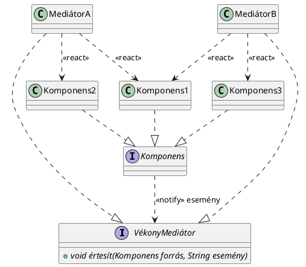

**VastagMediátor UML:**

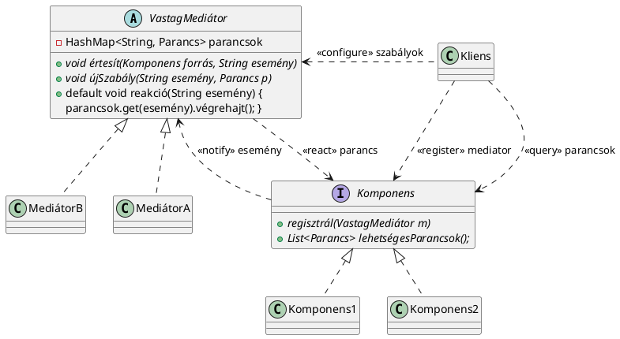

### 4. Példakód

**VékonyMediátor Példakód:**

```java
interface VékonyMediátor {
    void értesít(Komponens forrás, String esemény);
}

interface Komponens {
    void regisztrál(VékonyMediátor mediator);
}

class MediátorA implements VékonyMediátor {
    @Override
    public void értesít(Komponens forrás, String esemény) {
        // Reakciók kezelése
    }
}

class Komponens1 implements Komponens {
    VékonyMediátor mediator;
    @Override
    public void regisztrál(VékonyMediátor mediator) {
        this.mediator = mediator;
    }
}
```

**VastagMediátor Példakód:**

```java
abstract class VastagMediátor {
    private HashMap<String, Parancs> parancsok = new HashMap<>();
    
    public abstract void értesít(Komponens forrás, String esemény);
    
    public void újSzabály(String esemény, Parancs p) {
        parancsok.put(esemény, p);
    }
    
    public void reakció(String esemény) {
        parancsok.get(esemény).végrehajt();
    }
}

interface Komponens {
    void regisztrál(VastagMediátor m);
    List<Parancs> lehetségesParancsok();
}

class Komponens1 implements Komponens {
    private VastagMediátor mediator;
    @Override
    public void regisztrál(VastagMediátor m) {
        this.mediator = m;
    }
    
    @Override
    public List<Parancs> lehetségesParancsok() {
        // Kiválasztott parancsok listája
        return new ArrayList<>();
    }
}

class Parancs {
    void végrehajt() {
        // Parancs végrehajtása
    }
}
```


### 1. Értelmezés/Felsorolásos szöveg:
A **Pillanatkép (Memento vagy Snapshot)** tervezési minta az objektumok belső állapotának elmentésére és későbbi visszaállítására szolgál. A minta célja, hogy egy objektum aktuális állapotát, annak belső adatainak mentését és visszaállítását biztosítsa.

A Pillanatkép minta jellemzői:
- A Java nyelvben a **Serializable** interfész felel meg a Pillanatkép mintának, amely egy üres interfész, nem tartalmaz metódusokat.
- A **Serializable** interfésznek nincs saját viselkedése, de lehetővé teszi, hogy objektumokat szerializáljunk és deszerializáljunk (állapot mentése és visszaállítása byte folyamok segítségével).
- Az objektumok mezőinek szerializálhatónak kell lenniük. A **transient** kulcsszóval deklarált mezők nem vesznek részt a szerializálásban.
- A **ObjectOutputStream** és **FileInputStream** osztályok biztosítják a szerializációt és deszerializációt.
- A minta gyakran hasznos távoli metódus hívásoknál (RPC), ahol az objektumokat nem közvetlenül, hanem byte folyamokon keresztül küldjük.

**Kritikai megjegyzés**: A Java **Serializable** interfész nem teljesen illeszkedik a klasszikus GOF leírásához, de hasonlóan működik, tehát ebben a fejezetben annak használatát elemeztük.

### 2. DIP/ Nem DIP kérdés vizsgálata:
- **DIP (Dependency Inversion Principle)**: Igen, a **Serializable** interfész alkalmazásával valóban szétválik az absztrakció és a konkrét megvalósítás. Az objektumok szerializálhatósága nem függ a konkrét implementációktól, csak a **Serializable** interfész meglététől.
- **HAS-A és IS-A kapcsolat**: A **Serializable** interfész egy IS-A kapcsolatot biztosít, mivel az osztályok implementálják azt, hogy szerializálhatóak legyenek.
- A **Serializable** interfész tehát **DIP** minta, mivel jól elválasztja az objektumok belső állapotát és a szerializálás folyamatát.

### 3. UML kód a szövegből:
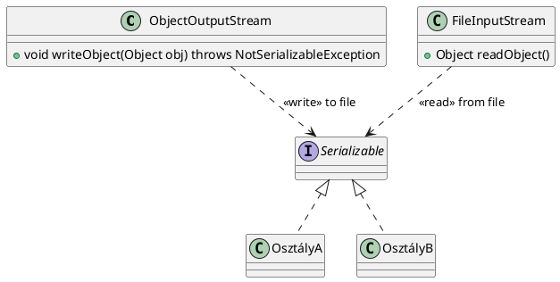

### 4. Példakód:
```java
import java.io.*;

// Objektum osztály
class OsztályA implements Serializable {
    private int szám;
    private transient String jelszó; // Nem szerializálható
    public OsztályA(int szám, String jelszó) {
        this.szám = szám;
        this.jelszó = jelszó;
    }
}

// Pillanatkép készítése
public class MementoExample {
    public static void main(String[] args) {
        OsztályA obj = new OsztályA(10, "titok");

        // Szerializálás
        try (ObjectOutputStream oos = new ObjectOutputStream(new FileOutputStream("memento.dat"))) {
            oos.writeObject(obj);
        } catch (IOException e) {
            e.printStackTrace();
        }

        // Deszerializálás
        try (ObjectInputStream ois = new ObjectInputStream(new FileInputStream("memento.dat"))) {
            OsztályA objDeserialized = (OsztályA) ois.readObject();
            System.out.println("Szám: " + objDeserialized.szám);
            // A jelszó értéke null lesz, mivel transient
            System.out.println("Jelszó: " + objDeserialized.jelszó);
        } catch (IOException | ClassNotFoundException e) {
            e.printStackTrace();
        }
    }
}
```

### Összefoglalás:
A **Pillanatkép** minta a szerializációs mechanizmus használatával segít az objektumok belső állapotának mentésében és későbbi visszaállításában. A Java-ban a **Serializable** interfész használatával valósítható meg, amely a klasszikus GOF leírásból eltérő módon, de ugyanazt a funkciót biztosítja. Az interfész alkalmazásával betartjuk a **DIP**-t, mivel jól elválasztja a szerializálható objektumokat és azok kezelését.

### 1. Értelmezés/Felsorolásos szöveg:

- **Állapot minta**: Az Állapot minta egy viselkedés-alapú tervezési minta, amely különböző állapotokat képviselő osztályokkal valósítja meg a viselkedési különbségeket. A példában egy MP3 lejátszó és rádió alkalmazásra mutatunk be egy megoldást, ahol az eszköz különböző állapotokban eltérően viselkedik.
- **Player osztály**: A `Player` osztály felelős az állapotok közötti váltásért és a különböző funkciók delegálásáért az aktuális állapotnak.
- **State interfész**: Az `State` interfész deklarálja az összes elérhető metódust, amit az állapotok implementálnak: `play()`, `next()`, `radio_mp3()`.
- **MP3 és Radio osztályok**: Ezek az osztályok implementálják az `State` interfészt, és a megfelelő állapotok szerint kezelik a `play()` és `radio_mp3()` metódusokat. Az `MP3` és `Radio` osztályok referenciát tartanak a `Player` osztályra, hogy az állapotátmenetet kezeljék.
- **Állapotátmenet**: A `Player` osztályban a `changeState()` metódus váltja az állapotot, ez biztosítja, hogy a `Player` osztály mindig tudja, melyik állapotot alkalmazza.

### 2. DIP/Nem DIP kérdés vizsgálata:

- **DIP** (Dependency Inversion Principle): A tervezési mintában a két oldal (Player és State) közötti kapcsolatot fel lehet bontani úgy, hogy egy magasabb szintű absztrakciót (például egy interfészt) hozunk létre, ami jobban illeszkedik a DIP-hez.
    - Az alap megoldásnál a `Player` tudja, hogy hogyan kell delegálni a feladatokat a `State` interfész implementációinak, de a `Player` osztály túl sokat tud a `State` osztályok működéséről, így a két osztály között nem teljesen tiszta a DIP.
    - A `changeState()` metódus használata segíthet elérni a DIP-t, mert nincs közvetlen kapcsolat a két osztály között.
    - Azonban a **StateFactory** bevezetése segíthet jobban kezelni az állapotok közötti váltásokat és csökkenthet a kölcsönös függőségeket.

- **Nem DIP**: A `Player` és `State` közötti közvetlen kapcsolat, amikor a `State` osztályok referenciát tartanak a `Player` osztályra, nem felel meg a DIP-nek, mivel mindkét osztály ismeri egymást.

### 3. UML kód a szövegből:

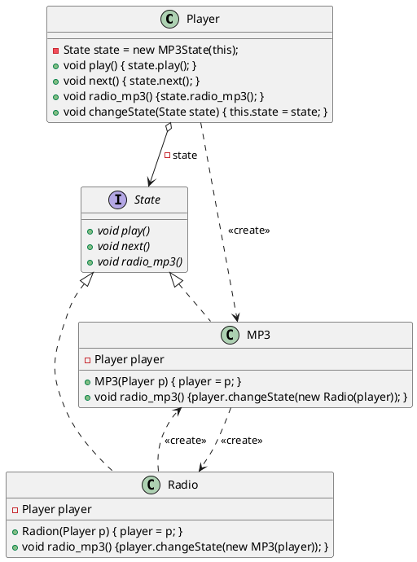

### 4. Példakód:

```java
// Player osztály
class Player {
    private State state;

    public Player() {
        this.state = new MP3State(this); // Kezdeti állapot
    }

    public void play() {
        state.play();
    }

    public void next() {
        state.next();
    }

    public void radio_mp3() {
        state.radio_mp3();
    }

    public void changeState(State state) {
        this.state = state;
    }
}

// State interfész
interface State {
    void play();
    void next();
    void radio_mp3();
}

// MP3 osztály
class MP3 implements State {
    private Player player;

    public MP3(Player p) {
        this.player = p;
    }

    @Override
    public void play() {
        // MP3 play logika
        System.out.println("Playing MP3");
    }

    @Override
    public void next() {
        // MP3 next logika
        System.out.println("Next MP3 track");
    }

    @Override
    public void radio_mp3() {
        player.changeState(new Radio(player)); // Állapotváltás
    }
}

// Radio osztály
class Radio implements State {
    private Player player;

    public Radio(Player p) {
        this.player = p;
    }

    @Override
    public void play() {
        // Radio play logika
        System.out.println("Playing Radio");
    }

    @Override
    public void next() {
        // Radio next logika
        System.out.println("Next Radio station");
    }

    @Override
    public void radio_mp3() {
        player.changeState(new MP3(player)); // Állapotváltás
    }
}
```

Ezek a kódok és UML diagramok bemutatják, hogyan használható az Állapot minta a `Player` és különböző `State` osztályok közötti váltás kezelésére. A DIP megközelítésben a két osztály közötti közvetlen függőség csökkentésére fókuszálunk.


**1. Értelmezés/Felsorolásos szöveg:**

A Stratégia tervezési minta célja, hogy egy változékony metódust külön osztályhierarchiába emeljen, amelyet egy referencia mutat. A referencia segítségével a megfelelő verziót érhetjük el. A Stratégia minta alkalmazása biztosítja, hogy a metódus implementációját könnyen változtathassuk anélkül, hogy az érintett osztályok módosítása szükséges lenne.

- **Kacsa osztály**: Képviseli azokat az objektumokat, amelyek rendelkeznek repülési stratégiával.
  - **RepülésiStratégia**: Az interface, amely tartalmazza a repülési metódust, amit különböző implementációk valósítanak meg.
  - **JólRepül** és **NemRepül** osztályok: Az absztrakció konkrét implementációi, amelyek a repülési stratégiák konkrét viselkedéseit tartalmazzák.

A Stratégia minta alkalmazásával a metódus delegálása történik: a felelősség átadásra kerül a repülési stratégiára, anélkül, hogy a Kacsa osztálynak bármilyen tudomása lenne a stratégiák részleteiről.

**2. DIP/Nem DIP kérdés vizsgálata:**

A Stratégia tervezési minta jól illeszkedik a Dependency Inversion Principle (DIP) elvéhez, mivel:
- **Minden nyíl absztrakcióra mutat**: A Kacsa osztály a **RepülésiStratégia** interfészre hivatkozik, nem pedig egy konkrét implementációra.
- **Van olyan absztrakció, amire HAS-A és IS-A kapcsolat is mutat**: A **RepülésiStratégia** interfész az absztrakció, amelyhez mind a Kacsa osztály, mint a repülési stratégiák (JólRepül, NemRepül) kapcsolódnak.
- **A két oldal szétválasztása**: A Kacsa nem ismeri a repülési stratégiák implementációját, csak egy absztrakcióra hivatkozik. A repülési stratégiák nem tudnak semmit a Kacsáról, ami biztosítja a két oldal szétválasztását.

Ez az elválasztás azt jelenti, hogy a **Stratégia** minta megfelel a DIP-nek.

**3. UML kód:**

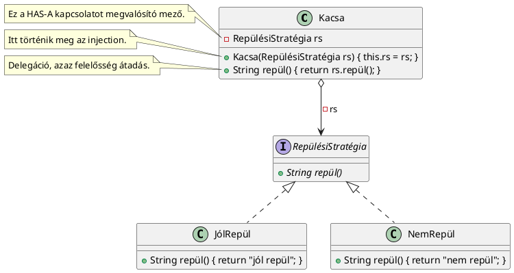

**4. Példakód:**

```java
interface RepülésiStratégia {
    String repül();
}

class JólRepül implements RepülésiStratégia {
    @Override
    public String repül() {
        return "jól repül";
    }
}

class NemRepül implements RepülésiStratégia {
    @Override
    public String repül() {
        return "nem repül";
    }
}

class Kacsa {
    private RepülésiStratégia rs;

    public Kacsa(RepülésiStratégia rs) {
        this.rs = rs;
    }

    public String repül() {
        return rs.repül();
    }
}

public class Main {
    public static void main(String[] args) {
        Kacsa kacsaJolRepul = new Kacsa(new JólRepül());
        Kacsa kacsaNemRepul = new Kacsa(new NemRepül());

        System.out.println(kacsaJolRepul.repül()); // "jól repül"
        System.out.println(kacsaNemRepul.repül()); // "nem repül"
    }
}
```

### 1. Értelmezés/Felsorolásos Szöveg

A **Sablon- és Gyártó Metódus** (Template- and Factory Method) tervezési minta hasonló a **stratégia** mintához, de itt a lépések sorrendje fixált, ugyanakkor a lépések konkrét megvalósítása a gyermekosztályokra van bízva. A minta három fő lépést különböztet meg:

- **Kötelező, és közös lépések**: Ezeket az ősosztályban dolgozzuk ki.
- **Kötelező, de nem közös lépések**: Ezek az ősosztályban absztraktok, a gyerekosztályokra bízzuk a megvalósítást.
- **Nem közös (opcionális) lépések**: Ezek hook metódusok, amelyeket a gyerekosztályok választhatnak, hogy implementálnak-e.

A minta lényege, hogy a fő algoritmus sorrendjét az ősosztály biztosítja, míg a részleteket (pl. hogyan készítjük el a italt) a gyermekosztályok végzik el.

A **Sablon- és Gyártó Metódus** között a különbség az, hogy a Sablon Metódus **void** visszatérési típusú metódust használ, míg a Gyártó Metódus nem void, és általában valamilyen terméket hoz létre. Az IoC (Inversion of Control) és DIP (Dependency Inversion Principle) elveket alkalmazza a minta, mivel a gyermekosztályok implementálják a részleteket, de nem tudnak a szülőosztályról, és a kliensek csak a publikus sablon- vagy gyártó metódust ismerik.

### 2. DIP/Nem DIP Kérdés Vizsgálata

- **Minden nyíl absztrakcióra mutat?**  
  Igen! Az ősosztály a konkrét megvalósítástól elválasztja az absztrakciókat, a gyermekosztályok pedig azokat a konkrét lépéseket valósítják meg, amelyek az algoritmus részét képezik.
  
- **Van olyan absztrakció, amire HAS-A és IS-A kapcsolat is mutat?**  
  Igen, a `ForróItalFőzés` absztrakt osztály esetén az IS-A kapcsolat a gyermekosztályokkal (pl. `KávéFőzés`, `TeaFőzés`), a HAS-A kapcsolat pedig a metódusokkal való együttműködés révén jelenik meg.
  
- **Ez az absztrakció szétválasztja a két oldalt?**  
  Igen, a kliens csak a sablon- vagy gyártó metódust használja, de nem tudja, hogyan valósul meg az algoritmus egyes lépései. Az ősosztály nem tud a kliensről, és a gyermekosztályok sem tudnak az ősosztályról.

- **Ez egy DIP?**  
  Igen! A minta elválasztja a klienst a sablon implementációjától, és biztosítja, hogy a kliensek csak egy absztrakcióval dolgoznak.

### 3. UML Kód

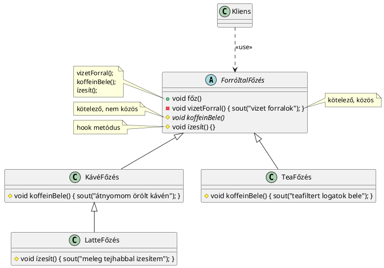

### 4. Példakód

```java
abstract class ForróItalFőzés {
    public void főz() {
        vizetForral();
        koffeinBele();
        ízesít();
    }

    // Kötelező, közös lépés
    private void vizetForral() {
        System.out.println("vizet forralok");
    }

    // Kötelező, de nem közös lépés (gyermek osztály implementálja)
    abstract void koffeinBele();

    // Nem közös, opcionális lépés (hook metódus)
    void ízesít() {
        // Hook, alapértelmezett viselkedés, gyerek osztály felülbírálhatja
        System.out.println("Alap ízesítés");
    }
}

class KávéFőzés extends ForróItalFőzés {
    @Override
    void koffeinBele() {
        System.out.println("Átnyomom örölt kávén");
    }
}

class TeaFőzés extends ForróItalFőzés {
    @Override
    void koffeinBele() {
        System.out.println("Teafiltert logatok bele");
    }
}

class LatteFőzés extends KávéFőzés {
    @Override
    void ízesít() {
        System.out.println("Meleg tejhabbal ízesítem");
    }
}

public class Main {
    public static void main(String[] args) {
        ForróItalFőzés kávé = new KávéFőzés();
        kávé.főz();

        ForróItalFőzés tea = new TeaFőzés();
        tea.főz();

        ForróItalFőzés latte = new LatteFőzés();
        latte.főz();
    }
}
```

A fenti példakódban a `ForróItalFőzés` osztály a közös lépéseket biztosítja, a gyermekosztályok pedig a specifikus lépéseket (pl. `koffeinBele`) implementálják. A `LatteFőzés` osztály például a `ízesít` metódust felülbírálja, hogy saját viselkedést biztosítson.

## Azok a tervezési minták, amiben nincs DIP

### 8.5.1. Egyke (Singleton)
**1. Értelmezés/felsorolásos szöveg:**
- A Singleton minta egyetlen példányt biztosít egy osztályból, amelyet globálisan bárhonnan elérhetünk.
- Az osztály rendelkezik egy statikus változóval (`instance`), amely tárolja az egyetlen példányt.
- A példány elérésére szolgáló metódus (`getInstance()`) biztosítja, hogy ne legyen több példány az osztályból.
- A minta általában globális erőforrások kezelésére használatos, mint például naplózás vagy konfiguráció.

**2. DIP/nem DIP kérdés vizsgálata:**
- A Singleton minta nem valósítja meg a DIP (Dependency Inversion Principle) alapelvet.
- Mivel az osztály nem rendelkezik sem IS-A, sem HAS-A kapcsolattal más osztályokkal, nincs absztrakció, amely elválasztaná az osztályt a kliensektől.
- Az osztály statikusan hivatkozik az instance példányra, így nincs lehetőség a függőségek külső forrással való injektálására (pl. IoC, Dependency Injection).

**3. UML kód:**
```plantuml
@startuml
class Singleton {
  -{static} Singleton instance = new Singleton();
  -String globálisErőforrás
  -Singleton()
  +{static} Singleton getInstance() { return instance; }
  +String globálisSzolgáltatás()
@enduml
```

**4. Példakód:**
```java
public class Singleton {
    private static Singleton instance = new Singleton();
    private String globálisErőforrás;

    private Singleton() {
        // Konstruktor
    }

    public static Singleton getInstance() {
        return instance;
    }

    public String globálisSzolgáltatás() {
        return globálisErőforrás;
    }
}
```

---

### 8.5.2. Homlokzat (Facade)
**1. Értelmezés/felsorolásos szöveg:**
- A Homlokzat minta egyszerűsíti egy bonyolult rendszer használatát, egy átláthatóbb interfészen keresztül.
- A minta célja, hogy egy egyszerűsített API-t nyújtson az alrendszerek számára, elrejtve azok komplexitását.
- A Homlokzat osztály tartalmazza az alrendszerek hívásainak logikáját, de maga nem implementálja az alrendszerek működését.
- A Homlokzat és a Kliens közötti kapcsolatot egy interfész (RétegSzolgáltatások) biztosítja.

**2. DIP/nem DIP kérdés vizsgálata:**
- A Homlokzat minta megvalósítja a DIP alapelvet, mivel a Kliens osztály a Homlokzat osztályt használja, amely az interfészen keresztül kommunikál a szolgáltatásokkal.
- A Kliens nem függ közvetlenül a Homlokzat osztály konkrét megvalósításától, hanem egy absztrakciót (RétegSzolgáltatások) használ.
- Azonban maga a Homlokzat osztály nem valósítja meg a DIP-t, mivel konkrét alrendszerekre (AlsóRészA, AlsóRészB) támaszkodik.

**3. UML kód:**
```plantuml
@startuml
class Kliens {}
interface RétegSzolgáltatások {
  +{abstract} void szolgáltatás1()
  +{abstract} void szolgáltatás2()
  +{abstract} void szolgáltatás3()
}
class Homlokzat {
  -AlsóRészA a = new AlsóRészA();
  -AlsóRészB b = new AlsóRészB();
  +void szolgáltatás1() { a.szolgáltatás1(); b.szolgáltatás1(); }
  +void szolgáltatás2() { b.szolgáltatás2(); a.szolgáltatás2(); }
  +void szolgáltatás3() { a.szolgáltatás3(); }
}
class AlsóRészA {
  +void szolgáltatás1()
  +void szolgáltatás2()
  +void szolgáltatás3()
}
class AlsóRészB {
  +void szolgáltatás1()
  +void szolgáltatás2()
}
Kliens .right.> RétegSzolgáltatások : <<use>>
RétegSzolgáltatások <|.. Homlokzat
Homlokzat *--> AlsóRészA : -a
Homlokzat *--> AlsóRészB : -b
@enduml
```

**4. Példakód:**
```java
interface RétegSzolgáltatások {
    void szolgáltatás1();
    void szolgáltatás2();
    void szolgáltatás3();
}

class Homlokzat implements RétegSzolgáltatások {
    private AlsóRészA a = new AlsóRészA();
    private AlsóRészB b = new AlsóRészB();

    @Override
    public void szolgáltatás1() {
        a.szolgáltatás1();
        b.szolgáltatás1();
    }

    @Override
    public void szolgáltatás2() {
        b.szolgáltatás2();
        a.szolgáltatás2();
    }

    @Override
    public void szolgáltatás3() {
        a.szolgáltatás3();
    }
}

class AlsóRészA {
    public void szolgáltatás1() { /* implementáció */ }
    public void szolgáltatás2() { /* implementáció */ }
    public void szolgáltatás3() { /* implementáció */ }
}

class AlsóRészB {
    public void szolgáltatás1() { /* implementáció */ }
    public void szolgáltatás2() { /* implementáció */ }
}
```

---

### 8.5.3. Illesztő (Adapter)
**1. Értelmezés/felsorolásos szöveg:**
- Az Illesztő minta célja, hogy két inkompatibilis interfészt összehozzon.
- Egy meglévő osztályhoz új interfészt illeszt, amely lehetővé teszi a régi osztály használatát egy új rendszerben.
- Az illesztő osztály egy meglévő metódust egy másik típusú metódusra alakít át.

**2. DIP/nem DIP kérdés vizsgálata:**
- Az Illesztő minta nem valósítja meg a DIP alapelvet, mivel nem használ absztrakciót az osztályok közötti kapcsolat kezelésére.
- Az adapter (Robot2Ember) nem absztrakt, és nem használ elválasztást az interfészek és az implementációk között, ezért nem támogatja a DIP-et.

**3. UML kód:**
```plantuml
@startuml
class Robot {
  +String getID()
}
interface Ember {
  +String getNév()
}
class Robot2Ember {
  -Robot robot
  +Robot2Ember(Robot robot)
  +String getNév() { return robot.getID(); }
}
Robot2Ember .up.|> Ember
Robot2Ember o-right-> Robot : -robot
@enduml
```

**4. Példakód:**
```java
interface Ember {
    String getNév();
}

class Robot {
    String getID() {
        return "robot123";
    }
}

class Robot2Ember implements Ember {
    private Robot robot;

    public Robot2Ember(Robot robot) {
        this.robot = robot;
    }

    @Override
    public String getNév() {
        return robot.getID();
    }
}
```

---

### 8.5.4. Látogató (Visitor)
**1. Értelmezés/felsorolásos szöveg:**
- A Látogató minta a kétféle hivatkozásfeloldást kombinálja: egyszeres és kétszeres hivatkozásfeloldást.
- A minta célja, hogy különböző típusú objektumokhoz különböző műveleteket végezzen anélkül, hogy az objektumok osztályait módosítaná.
- A minta használatával bővíthetjük az objektum hierarchiáját anélkül, hogy az osztályokat módosítanunk kellene.

**2. DIP/nem DIP kérdés vizsgálata:**
- A Látogató minta valójában egyfajta DIP-ot alkalmaz, mivel az objektumok típusától függetlenül a látogató (Visitor) osztály végzi a műveleteket.
- A Látogató osztály és az objektumok közötti kapcsolat absztrakcióval van kezelve, így támogatja a DIP elvet.

**3. UML kód:**
```plantuml
@startuml
interface BinFa {
  +{abstract} void accept(Visitor v)
}
class Ág {
  -BinFa bal, jobb
  +Ág(BinFa bal, BinFa jobb)
  +void accept(Visitor v

)
}
class Levél {
  +void accept(Visitor v)
}
interface Visitor {
  +void visit(Ág ág)
  +void visit(Levél levél)
}
Ág *-- BinFa
Levél *-- BinFa
Visitor <|.. Ág
Visitor <|.. Levél
@enduml
```

**4. Példakód:**
```java
interface BinFa {
    void accept(Visitor v);
}

class Ág implements BinFa {
    private BinFa bal, jobb;

    public Ág(BinFa bal, BinFa jobb) {
        this.bal = bal;
        this.jobb = jobb;
    }

    @Override
    public void accept(Visitor v) {
        v.visit(this);
    }
}

class Levél implements BinFa {
    @Override
    public void accept(Visitor v) {
        v.visit(this);
    }
}

interface Visitor {
    void visit(Ág ág);
    void visit(Levél levél);
}

class KiszámolVisitor implements Visitor {
    @Override
    public void visit(Ág ág) {
        // Ág feldolgozása
    }

    @Override
    public void visit(Levél levél) {
        // Levél feldolgozása
    }
}
```

