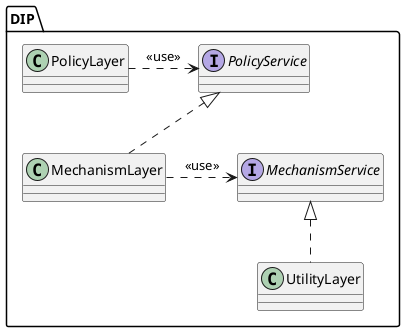
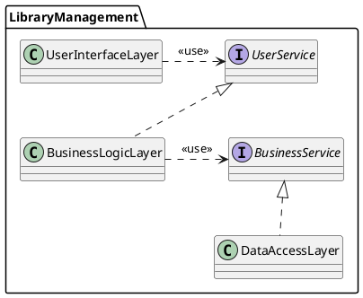

### **7.2. A DIP UML osztálydiagram ábrája**

Nézzük meg a DIP (Dependency Inversion Principle) ábráját, amely a Wikipédián is elérhető. Ez az ábra egy háromrétegű architektúrát mutat be, amely a DIP elvének megfelelően épül fel. Az alábbi PlantUML szkript generálja az ábrát:

#### **PlantUML szkript (DIP ábra)**

---

### **Más téma: Példa egy könyvtármenedzsment rendszerre**

Írjuk át a fenti ábrát egy könyvtármenedzsment rendszer architektúrájának modellezésére, amely szintén háromrétegű struktúrát alkalmaz. A rétegek a következő szerepeket töltik be:

1. **Felhasználói felület réteg (UserInterfaceLayer)**: Ez a réteg felel a felhasználókkal való interakcióért.
2. **Üzleti logika réteg (BusinessLogicLayer)**: Ez a réteg tartalmazza az üzleti logikát és a szolgáltatásokat.
3. **Adatkezelés réteg (DataAccessLayer)**: Ez a réteg felel az adatok kezeléséért és tárolásáért.

#### **PlantUML szkript (Könyvtármenedzsment rendszer)**

---

### **Magyarázat**

A fenti ábra az alábbi elveket mutatja be:
- A **UserInterfaceLayer** használja a **UserService** szolgáltatásokat.
- A **BusinessLogicLayer** implementálja a **UserService** interfészt, miközben maga is használja a **BusinessService** interfészt.
- A **DataAccessLayer** implementálja a **BusinessService** interfészt, biztosítva az adatok kezelését.

Ez a modell jól tükrözi a háromrétegű architektúrák általános elveit, miközben megfelel a DIP elvnek, amely a magas szintű modulokat függetleníti az alacsony szintű moduloktól.