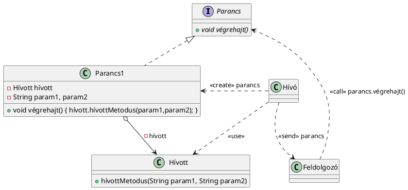

### **Feldolgozott szöveg: Parancs tervezési minta**

#### **1. UML ábra és PlantUML szkript**
**Parancs tervezési minta UML ábrája:**



---

#### **2. Példa kód**
**Parancs tervezési minta egy szövegszerkesztő példáján keresztül:**

```java
interface Parancs {
    void végrehajt();
}

class BeillesztParancs implements Parancs {
    private Szovegszerkeszto szerkeszto;

    public BeillesztParancs(Szovegszerkeszto szerkeszto) {
        this.szerkeszto = szerkeszto;
    }

    @Override
    public void végrehajt() {
        szerkeszto.beilleszt();
    }
}

class Szovegszerkeszto {
    public void beilleszt() {
        System.out.println("Szöveg beillesztve.");
    }
}

class Feldolgozo {
    private Parancs parancs;

    public void setParancs(Parancs parancs) {
        this.parancs = parancs;
    }

    public void végrehajtParancs() {
        if (parancs != null) {
            parancs.végrehajt();
        }
    }
}

// Használat
public class Main {
    public static void main(String[] args) {
        Szovegszerkeszto szerkeszto = new Szovegszerkeszto();
        Parancs beillesztParancs = new BeillesztParancs(szerkeszto);

        Feldolgozo feldolgozo = new Feldolgozo();
        feldolgozo.setParancs(beillesztParancs);
        
        // Szöveg beillesztése:
        feldolgozo.végrehajtParancs();
    }
}
```

---

#### **3. Értelmezés**
A **Parancs (Command)** tervezési minta célja, hogy egy adott műveletet (metódushívást) becsomagoljunk egy objektumba, amely tartalmazza:
1. **A hívás logikáját** (pl. melyik objektum melyik metódusát kell meghívni).
2. **A szükséges paramétereket**, amelyeket akár előre, akár dinamikusan biztosítunk.

**Fő szereplők a mintában:**
- **Parancs (Command):** Egy absztrakt interfész, amely meghatározza a `végrehajt` metódust.
- **Konkrét Parancs (Concrete Command):** Implementálja a `végrehajt` metódust, és tárolja a szükséges logikát és adatokat.
- **Feldolgozó (Invoker):** A parancsot meghívja, de nem tud a konkrét műveletekről.
- **Hívott (Receiver):** Az objektum, amely végrehajtja a konkrét műveletet.
- **Hívó (Client):** A parancs objektumokat létrehozza, majd átadja őket a Feldolgozónak.

**Példa:**
Egy szövegszerkesztőben a **Beilleszt gomb** és a **Ctrl+V** billentyűkombináció ugyanazt a műveletet hajtja végre. Ezt a műveletet érdemes a parancs tervezési mintával implementálni, így a logika nem duplikálódik, és egységesen kezelhető.

---

#### **4. DIP (Dependency Inversion Principle) vizsgálata**
A DIP szerint:
1. **Magas szintű modulok** ne függjenek alacsony szintű moduloktól, mindkettőnek absztrakcióktól kell függenie.
2. Az absztrakciók ne függjenek a konkrét megvalósítástól.

**Vizsgálat:**
- A Parancs interfész szétválasztja a Feldolgozót és a Hívott osztályokat. A Feldolgozó a parancs objektummal kommunikál, nem ismeri annak konkrét implementációját.
- **Megfigyelések:**
  - A **Hívó** ismeri a **Hívott** egy példányát, mert létrehozza a konkrét parancsot. Ez nem sérti a DIP-t, mivel a Hívó és Hívott közti kapcsolat itt nem a magas/alacsony szintű modulok közti függés.
  - A Feldolgozó absztrakcióra (Parancs) támaszkodik, nem konkrét implementációra.

**Következtetés:**
A minta DIP kompatibilis, mivel a Parancs interfész elválasztja a Feldolgozót és a Hívott osztályokat, biztosítva a függetlenséget. A Hívó és Hívott közti asszociáció nem problémás, mert csak a parancs létrehozásához szükséges.