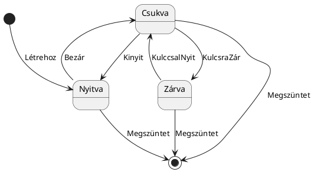
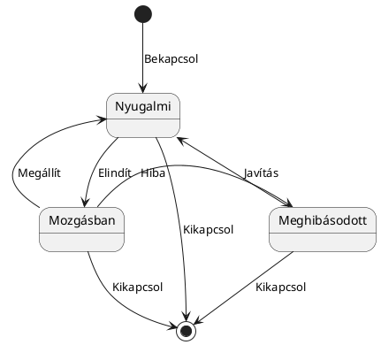

### **7.9.1. UML állapotgép diagram**

#### **Eredeti példa: Ajtó állapotai**

---

#### **Átirat: Lift állapotai**

---

### **Felhasznált elemek**

- **Kezdőállapot:** `[ * ]` jelöli.
- **Végállapot:** `[ * ]` jelöli.
- **Állapotok:** Lekerekített téglalapok (pl. *Nyitva*, *Csukva*, *Zárva* vagy *Nyugalmi*, *Mozgásban*, *Meghibásodott*).
- **Állapotátmenetek:** Nyilak, amelyek eseményeket/metódushívásokat reprezentálnak.