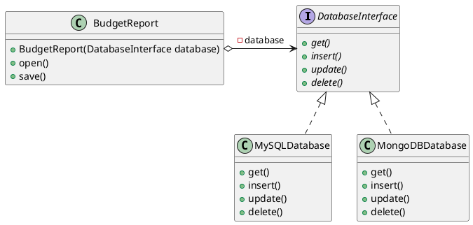
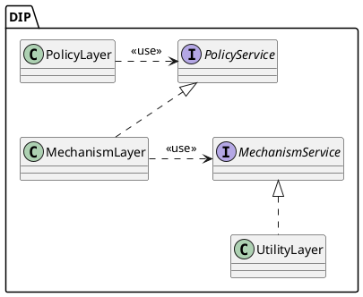

### Függőség Megfordításának Alapelve – DIP: Fejezetterv és Magyarázat

#### **Fejezetcél:**
- Bemutatja a DIP, azaz a Dependency Inversion Principle alapelvet a SOLID elvek kontextusában.

#### **1. Bevezetés a SOLID elvekbe**
- **SOLID rövid bemutatása:**
  - Az objektumorientált tervezés öt legfontosabb alapelve.
  - Betűszó jelentése: 
    - **SRP:** Egy felelősség - egy osztály alapelve.
    - **OCP:** Nyitva-zárt alapelv.
    - **LSP:** Liskov-féle behelyettesítési alapelv.
    - **ISP:** Interfészszegregációs alapelv.
    - **DIP:** Függőség megfordításának alapelve.
  - **Magyarázat:** Az elvek célja, hogy a szoftver rugalmasabb, könnyebben karbantartható és bővíthető legyen.

#### **2. Az eddigi SOLID alapelvek rövid áttekintése**
- **OCP (Open-Closed Principle):**
  - **Fontosság:** A változtatások veszélyesek, ezért csak absztrakt vagy hook metódusokat írjunk felül.
  - **Kapcsolat SRP-vel:** Az OCP követése általában az SRP-t is kielégíti.
  - **Magyarázat:** Az SRP megfogalmazása nehézkes, mert előrelátást igényel, de utólag indokolhatja a refaktorálást.
- **LSP (Liskov Substitution Principle):**
  - **Lényeg:** Egy alosztály akkor altípus, ha betartja az elő- és utófeltételeket.
  - **Magyarázat:** Szerződés alapú programozás részeként elő- és utófeltételeket definiálunk.
- **ISP (Interface Segregation Principle):**
  - **Fontosság:** Érdemes vékony interfészeket használni, hogy egy osztály csak azokat a metódusokat implementálja, amelyek valóban relevánsak számára.

#### **3. DIP alapelve**
- **Definíció:** A DIP célja a logikai és fizikai szintek szétválasztása, hogy azok ne függjenek közvetlenül egymástól, hanem absztrakciókon keresztül működjenek együtt.
- **Magyarázat:** 
  - A szintek közötti szerződés tartalmazza:
    - Elvárt bemenetek és kimenetek leírását.
    - Hibák és állapotátmenetek definícióját.
  - A felső szint (üzleti logika) a hívó, az alsó szint (szervizhívások) a hívott oldal szerepét tölti be.
  - **Elvárás:** A szinteknek az absztrakcióban egységesített szerződés szerint kell működniük, hogy változásuk ne okozzon más szinteken módosítást.

#### **4. DIP problémák és megszorítások**
- **Konvenciók hatása:** Például a Látogató tervezési minta konvenciói megsértik a DIP-t, mert mindkét szintet érintik, de nincsenek a szerződés részeként definiálva.
- **Magyarázat:** A DIP megsértése gyakran rejtett függőségekhez vezet, amelyek növelik a kód komplexitását és törékenységét.

#### **5. Szerződések állapotgépekkel**
- **Állapotgépek jelentősége:**
  - Egy állapotgép megadja, hogy milyen hívások után milyen állapotváltozások következnek be.
  - **Ellentmondás:** Az absztrakciók (pl. interfészek) önmagukban nem tartalmaznak belső állapotokat.
- **Magyarázat:** Az absztrakcióban megfogalmazott szerződést az alsó szint valósítja meg, és a felső szint kezeli a hibákat.

#### **6. UML és DIP kapcsolata**
- **UML alkalmazása DIP-re:**
  - Az UML osztálydiagramok és állapotdiagramok vizualizálják a DIP alapelveket.
  - **Korlát:** Az UML tervek és forráskód szinkronban tartása nehézségeket okozhat a kód folyamatos változása miatt.
- **MDA álom:** 
  - Az MDA (Model Driven Architecture) célja az UML-alapú automatikus kódgenerálás volt.
  - **Magyarázat:** Ez nem vált be, mert csak a forráskód elég részletes a megvalósításhoz.

#### **7. DIP relevanciája a modern fejlesztésben**
- **Mesterséges intelligencia szerepe:**
  - A nagy nyelvi modellek (pl. ChatGPT) képesek UML-diagramok alapján forráskódokat generálni.
  - **Hatás:** A junior programozók iránti igény csökkent, ami kihívásokat jelenthet a kezdők számára.

#### **8. Fejezetösszegzés**
- **Főbb tanulságok:**
  - A DIP segíti a szoftvermodulok lazább összekapcsolását.
  - Az UML és az állapotgépek hasznosak, de csak dokumentációs céllal érdemes alkalmazni őket.

#### **További kidolgozás javaslatai:**
- Minden fontos fogalom mellett adj példát a megértéshez (nem a jegyzetben).
- Használj PlantUML szkripteket az UML tervek vizualizálásához.

Ez egy remek példája annak, hogyan magyarázhatjuk el a *Dependency Inversion Principle (DIP)* alapelvét szemléletes és érthető módon, az autós metaforával kiegészítve. Az autós példa a DIP lényegét hangsúlyozza: 

- **Magas szintű modulok** (mint a sofőr, aki autót vezet) **ne függjenek közvetlenül az alacsony szintű moduloktól** (például az autó mechanikus részleteitől). 
- Ehelyett mindkettő egy **absztrakciótól** (a "KormányMű" interfésztől) függ, amely egyértelmű szerződést biztosít. 

### Az autós példa kulcsfontosságú elemei:
1. **Sofőr és KormányMű kapcsolat**:
   - A sofőr a "KormányMű" interfészen keresztül irányítja az autót. 
   - Nem érdekli, hogy az autó benzines, dízel, elektromos, vagy hogy milyen váltóval működik – csak azt tudja, hogy gázt adva gyorsul, fékezve lassul, kormányozva irányt változtat.

2. **Az absztrakció és a részletek viszonya**:
   - A sofőr absztrakt módon vezeti az autót, azaz a KormányMű API-ján keresztül.
   - Az Autó megvalósítja a KormányMű interfészt, de az alacsony szintű részletek (például szelepek, fékbetétek) el vannak rejtve a sofőr elől.

3. **Függetlenség**:
   - A KormányMű biztosítja, hogy a sofőr független legyen az autó belső mechanikájától.
   - Az Autó részletei pedig függenek a KormányMű interfésztől.

4. **Kód újrafelhasználhatósága és bővíthetősége**:
   - Az absztrakció biztosítja, hogy a sofőr bármilyen autót képes vezérelni, amely implementálja a KormányMű interfészt, legyen az akár egy új autótípus.

---

### UML-elemzés:
Az UML-diagram jól ábrázolja a DIP megvalósítását:
- Az **IS-A kapcsolat** az Autó és a KormányMű között a megvalósítást jelenti (az Autó implementálja a KormányMű interfészt).
- A **HAS-A kapcsolat** a Sofőr és a KormányMű között az aggregációt jelöli (a Sofőr egy KormányMű példányt használ).

#### Kritikai megjegyzések:
- A mezők kétszeres ábrázolása (osztály mezőként és a nyílon) felesleges, de oktatási céllal szándékos lehetett.
- Az absztrakt metódusok jelölése dőlt betűvel fontos, és ez segíti az interfészek megértését.

### Összefoglalás:
Ez az autós példa egyszerre mutatja be a DIP elméleti és gyakorlati oldalát, miközben segíti a programozók gondolkodását az absztrakciók helyes megtervezésében. Ezáltal a kód:
- **Rugalmasabb**, hiszen könnyen bővíthető új autótípusokkal.
- **Karban tarthatóbb**, mert a magas és alacsony szintű modulok nem függnek közvetlenül egymástól.

---

### Javaslat:
Ha szeretnéd a példát még érthetőbbé tenni, a **PlantUML ábrákhoz hozzáadhatsz újabb autótípusokat**, például egy **ElektromosAutó** osztályt, amely szintén implementálja a KormányMű interfészt. Ez vizuálisan is megerősítené a DIP alapelv gyakorlati előnyeit. 


Ez a fejezet az adatbázis-kezelő kiválasztásának dilemmáját, a DIP (Dependency Inversion Principle) alkalmazásának előnyeit, és a HAS-A kapcsolatok különböző típusait tárgyalja. Az alábbiakban összefoglalom a kulcspontokat, amelyek alapján rendszerezheted vagy bővítheted a fejezet tartalmát:

---

### **7.1.3 A híres adatbázis-kezelő dilemma**
**Kulcsgondolat**: Az adatbázis-kezelő választás fontos, de csak egy "piszkos részlet", amelyet egy absztrakció mögé kell rejteni.  
- A vezető fejlesztők gyakran túl sok időt töltenek ezzel a kérdéssel.  
- Ha az absztrakciót helyesen alkalmazzuk, az alkalmazás felső szintjei függetlenek lesznek az adatbázis implementációjától.  
- Példa egy absztrakt osztályra (`DatabaseInterface`), amely lehetővé teszi az adatbázis-kezelők (pl. MySQL, MongoDB) közötti cserélhetőséget.  
- A "piszkos részleteket" az absztrakció mögött tartva az alkalmazás könnyebben bővíthető és karbantartható.

### **PlantUML Példa**:
A `BudgetReport` osztály csak a `DatabaseInterface` absztrakciót ismeri, így könnyedén váltogathatunk adatbázis-kezelőt anélkül, hogy módosítanunk kellene a fő logikát.



---

### **7.2 A DIP UML osztálydiagram ábrája**
**Főbb pontok**:  
- A DIP lényege, hogy a magas szintű és alacsony szintű modulok közös absztrakcióra támaszkodnak.  
- A 3 réteg:  
  - **PolicyLayer**: üzleti logika.  
  - **MechanismLayer**: középső szint, ahol a mechanizmusok működnek.  
  - **UtilityLayer**: alacsony szint, hardverközeli réteg.  
- A rétegek közötti interfészek biztosítják a rugalmasságot és a függetlenséget.  
- Előbb az absztrakciókat kell definiálni, majd a konkrét megvalósításokat.  

### **PlantUML Példa a DIP-re**:


---

### **7.3 A HAS-A kapcsolat 3 fajtája és a DIP**
A HAS-A kapcsolatokat a birtoklás erőssége szerint osztályozzuk:  
1. **Kompozíció**: Erős kapcsolat. A birtokolt objektum a birtokossal együtt szűnik meg.  
2. **Aggregáció**: Gyengébb kapcsolat. A birtokolt objektum más által is elérhető lehet.  
3. **Barátság/Asszociáció**: Átmeneti kapcsolat, amely lehetőséget ad ideiglenes használatra (pl. metódusparaméterként kapott objektum).  

Az UML-ben ezeket különböző nyíltípusok jelölik:
- Kompozíció: `*-->`
- Aggregáció: `o-->`
- Barátság: `-->` vagy `..>`.

**Példa Barátságos HAS-A kapcsolatra**:
- Gitáros → Gitár, ahol a kapcsolat <<use>>, <<create>> vagy más egyedi típussal jelölhető.  

--- 

**Javaslatok a fejezet továbbfejlesztéséhez**:
1. Adj hozzá valós példákat a DIP alkalmazásáról, akár saját projektedből.  
2. Magyarázd el, hogyan segíti a DIP az újrafelhasználhatóságot és a karbantarthatóságot.  
3. Emeld ki a HAS-A kapcsolatok jelentőségét a DIP kontextusában, különös tekintettel a barátságos kapcsolatok rugalmasságára.  


Ez egy alapos és részletes bemutatása a kommunikációs rétegek tervezési elveinek, különös tekintettel a Dependency Inversion Principle (DIP) alkalmazására. Az anyag két fő példán keresztül mutatja be az elveket:

1. **Felső réteg irányítja az alsó réteget:** Az autó példájában a "Sofőr" (felső réteg) vezérli a "KormányMű" interfészen keresztül a "Autó" (alsó réteg) osztályt. Ez a megközelítés biztosítja, hogy az alsó réteg könnyen cserélhető maradjon, mivel a kommunikáció csak az absztrakción keresztül történik.

2. **Körkörös hivatkozás problémája és megoldása:** A szövegcserélő példánál láthatjuk, hogy a körkörös hivatkozások nem kívánatosak, mivel bonyolulttá és nehezen karbantarthatóvá teszik a rendszert. A körkörös kapcsolatot az interfészek szegregációjával és az absztrakció megfelelő alkalmazásával oldották fel.

### Kulcsfontosságú pontok:
- **Felső szint dominanciája:** A felső szint mindig kezdeményez és irányít, míg az alsó szint csak végrehajt.
- **Interfészek szerepe:** Az absztrakció, például az interfészek alkalmazása kulcsfontosságú a DIP elvének megvalósításában.
- **Körkörös hivatkozások feloldása:** A körkörös kapcsolatokat az interfészek pontos szegregációjával és az objektumok közötti függőségek minimalizálásával lehet elkerülni.

### Fejlesztési hibák és tanulságok:
- **Körkörös tervezési hibák:** A körkörös hivatkozások bonyolultságot, fordítási függőséget és karbantarthatósági problémákat eredményeznek.
- **DIP megoldások:** Az interfészek bevezetésével és a kliens oldali igények szerinti szűkített metódusok biztosításával a tervezési hibák elkerülhetők.

### Implementáció:
Az anyagban megadott PlantUML szkriptek illusztrálják, hogy a helyes tervezés hogyan valósítható meg. Az utolsó javított példában a SzóCserélő osztály az **interface segregation principle (ISP)** elvét is alkalmazza, külön interfészeket hozva létre az egyes funkciókhoz. Ez egy modulárisabb és skálázhatóbb megoldást eredményez.

### Hogyan folytassuk?
Az alsó réteg hibajelentési folyamata következik, amely szintén a DIP elvének betartására épül. A biztonságos működés érdekében az alsó rétegnek visszajelzéseket kell adnia a felső rétegnek, például hibák vagy állapotváltozások esetén, az absztrakcióval biztosított rugalmasságot megtartva.


Ez egy részletes leírás az Observer tervezési mintáról és annak használatáról hibakezelési mechanizmusokhoz, kiegészítve példákkal és UML ábrákkal. A dokumentum három fő megközelítést taglal: 

1. **Observer minta hibajelentésre:**
   - Az Observer minta segítségével a felső szint értesítést kap az alsó szinten történt hibákról.
   - A megfigyelő regisztrál az alsó szinthez, és értesítést kap, ha változás vagy hiba történik.
   - Például az UML modellben a *Megfigyelt* interfész tartalmazza a `regisztrál()` és az `értesít()` metódusokat, míg a *Megfigyelő* interfészben a `fogad()` metódus található.
   - Az Observer minta alkalmazásának lépései részletezve vannak, a hibakezelés végigkövetése a regisztrációtól a hiba fogadásáig.

2. **Alsó szint kivételdobása:**
   - Egy másik hibakezelési lehetőség a kivételek használata, ahol az alsó szint (például egy ajtó) kivételt dob, ha hiba történik.
   - Az UML ábra bemutatja, hogyan valósul meg a szolgáltatás (például *Ajto* osztály), és hogyan kezeli a felső szint a hibákat egy `try-catch` blokk segítségével.
   - Az absztrakció szintjén ez a szerződés része: a szolgáltatás metódusai (pl. `nyit()`, `zar()`) kivételeket dobhatnak, amelyeket a felső szint kezel.

3. **Felső szint referenciájának átadása az alsó szintnek:**
   - Az alsó szint a felső szint egy interfészen keresztüli reprezentációját látja.
   - A felső szint regisztrálja magát az alsó szintnél, például egy `regisztrál()` metóduson keresztül.
   - Az interfész segítségével az alsó szint csak azokat a műveleteket érheti el a felső szinten, amelyek relevánsak a kommunikáció szempontjából.

### Használati esetek és kódimplementáció:
- **Observer minta esetén:** Az Observer minta erősen decoupled (gyengén összekapcsolt) kommunikációt tesz lehetővé a szintek között, ami karbantarthatóbbá teszi a rendszert.
- **Kivételdobás esetén:** A kód logikai hibákat kezel, de nehezebb követni, ezért ajánlott tesztekkel ellenőrizni.
- **Referenciák átadása esetén:** Az alsó szint csak egy részleges interfészt lát a felső szintből, így minimalizálva az alsó szint tudását a felső szintről.

Az UML ábrák mellett a megvalósítandó kód is segít megérteni az egyes lépések közötti kapcsolatokat. A leírás alapján az Observer minta előnyei jól érvényesülnek hibakezelésnél, különösen összetettebb rendszerekben. 


A fent bemutatott részletek az LSP (Liskov Substitution Principle) és a szerződés alapú programozás elméleteiről szólnak, amelyeket Java példákon keresztül mutatnak be. A főbb pontokat az alábbiakban foglalhatjuk össze:

### Hogyan indulhat egy interfészből <<call>> nyíl?
1. **Default metódusok az interfészekben:**  
   Javában az interfészek támogatják a `default` kulcsszót, amely lehetővé teszi, hogy alapértelmezett implementációkat adjunk meg egy metódushoz. Ezáltal az interfész metódusa hívható, ha a konkrét osztály nem ír felül egy adott metódust.  
   Példa:
   ```java
   interface CsereStratégia {
       default String sokCsere(String szöveg, VanSzótár szótár, TudCserélni cserélő){
           szótár.getSzótár();
           return cserélő.csere();
       }
   }
   ```
   **Megkötés:** Ez a módszer csak asszociáció esetén működik, amikor a referenciákat paraméterben kapjuk meg.

2. **Interfész, mint API:**  
   Az interfész egy API-t reprezentál, amely tartalmazza a publikus metódusok fejléceit és azok szerződéseit. Az interfészben deklarált mezők mindig `public static final` lesznek, ezért az interfész nem tarthat belső állapotot.

### Szerződés alapú programozás az LSP tükrében
- **Előfeltételek és utófeltételek:**  
  Minden metódushoz tartozik egy szerződés, amely előírja, hogy ha a hívó betartja az előfeltételeket, a metódus garantálja az utófeltételek teljesülését.
  
- **Assert-ek és dokumentáció:**  
  Az elő- és utófeltételek assert-ekkel implementálhatók, vagy öndokumentáló megjegyzésekkel rögzíthetők. Például:
  ```java
  /**
   * @param szöveg A bemeneti szöveg.
   * @param szótár A szavak cseréjéhez szükséges szótár.
   * @param cserélő Az a mechanizmus, amely végrehajtja a cserét.
   * @return Az átalakított szöveg.
   */
  String sokCsere(String szöveg, VanSzótár szótár, TudCserélni cserélő);
  ```

- **Kényszerítés absztrakt osztályokkal:**  
  Az absztrakt osztályok és az IoC (Inversion of Control) használata lehetővé teszi a szerződés betartatásának bizonyos fokú kényszerítését.
  Példa:
  ```java
  abstract class BankAccount {
      protected double balance;

      public final double Withdraw(double amount) {
          assert(amount >= 0 && amount <= balance);
          double newBalance = WithdrawImp(amount);
          assert(newBalance == balance - amount);
          balance = newBalance;
          return balance;
      }

      protected abstract double WithdrawImp(double amount);
  }
  ```

### LSP és öröklődés
- **Altípus fogalma:**  
  Egy osztály csak akkor altípusa egy másiknak, ha az ősosztály minden tulajdonsága (előfeltételei, viselkedése) érvényes a gyermekosztály példányaira is.

- **Gyerekosztály implementáció:**  
  Az öröklés akkor értelmes, ha az ősnek nincsenek konkrét implementációi (pl. absztrakt osztály vagy interfész), így a gyermekosztály kitöltheti a hiányzó részeket.

### Példák és szemléltetés
A híres vasalós példán keresztül mutatja be a szerződés alapú programozás konzisztenciaelvét:
- **Környezet konzisztenciája:** A metódus előfeltételeinek teljesülése függ a környezettől. Pl. a vasaló nem melegszik túl, ha a bemeneti víz hőmérséklete megfelelő.  
- **Utófeltételek:** A metódus működése után garantálja, hogy a vasaló nem lépi túl a biztonságos hőmérsékletet.

Ha szeretnéd, a szöveget konkrét példákkal vagy további részletekkel kiegészíthetem. Milyen módosításokat szeretnél?


A példákban az **OCL (Object Constraint Language)** felhasználását mutattad be az UML tervezés során, különböző részletességi szinteken. A második és harmadik példák ugyanazt a koncepciót fedik le, de a megközelítésük eltér:

- **Példa 2:** Tartalmazza az OCL `context` kulcsszavát az interfész szövegében, kifejezetten kiemelve a környezetet, amelyben az elő- és utófeltételek érvényesek.
- **Példa 3:** Egyszerűsíti a szkriptet azáltal, hogy elhagyja a `context` részt, közvetlenül az interfész metódusaihoz rendelve a megszorításokat.

### Kritikák és észrevételek
- **Sebesség definíciója:** Az interfész szerint a sebesség nem lehet negatív, ami ütközik a valósággal, mivel a jármű hátrameneti sebessége is értelmezhető. Azonban a sebességmérőkön általában csak pozitív tartomány jelenik meg.
- **OCL és Java eltérések:** Az OCL `Real` típusát használja, míg Java-ban `double` van, ami némi zavart kelthet. Ez a típusok közti eltérés elfogadható, de érdemes figyelembe venni.
- **Gyorsulás és erő viszonya:** Az OCL szabályok nem részletezik, hogy a gyorsulás az erő mértékétől függ. Ez szándékos egyszerűsítés, hogy a tervezés a magas szintű absztrakcióra fókuszáljon.

### Absztrakt osztály használata
A példák szerint az absztrakt osztály lehetővé teszi a részletesebb szerződés (contract) megfogalmazását. Ezáltal például:
- Mezők (pl. `méret`, `maxMéret`) explicit módon definiálhatóak.
- További logikai feltételek (pl. kezdőértékek) bevezetése lehetséges.
- Az absztrakció részletezése elősegíti a konkrét implementációk megfelelő működését.

Viszont ez hátrányokkal is jár:
- A kezdeti értékek (pl. `maxMéret = 100`) konkrétumot visznek az absztrakcióba, ami ellentmondhat az interfészek absztrakciós elvének.
- Láthatósági problémák léphetnek fel a mezőknél, amelyeket csak közvetett metódusokkal (pl. `setMéret`) lehet kezelni.

### UML állapotgép diagram
Az UML állapotgép diagram a program működésének állapotok közti változását írja le. Egy tipikus állapotgép diagram tartalmazhat:
- **Kezdőállapotot (Initial state):** Az objektum induló állapotát.
- **Állapotokat:** Amelyeket lekerekített téglalappal jelölnek.
- **Állapotváltásokat (Transitions):** Események, amelyek nyilakkal jelzik az átmenetet egyik állapotból a másikba.
- **Végállapotot (Final state):** Az objektum élettartamának lezáró állapotát.

Ez a részletes leírás hasznos a tervezés során, különösen akkor, ha a projektben tervező is dolgozik, mivel világos útmutatót ad a programozók számára a rendszer viselkedéséről. Az állapotgépek és a DIP elvei együttesen biztosítják a rugalmas, karbantartható kódot.

### 7.10. A DIP vizsgálata Imperatív vs. Deklaratív szemszögből

A **Függőségek Inverziójának Elve** (Dependency Inversion Principle, DIP) egyik központi gondolata, hogy elválasztja a **MIT** és **HOGYAN** kérdéseket. Az absztrakciók – például az interfészek – megadják, **MIT** kell végrehajtani, míg az implementációs osztályok biztosítják a **HOGYAN** kérdés megválaszolását. E két elem közötti különbségtétel nemcsak a szoftvertervezésben, hanem a programozási paradigmák megértésében is kiemelkedő fontosságú.  

#### Imperatív és deklaratív paradigmák összehasonlítása
A programozási nyelvek két nagy családra oszthatók:
- **Imperatív nyelvek**: A programozó pontosan meghatározza a **HOGYAN** kérdést, azaz az algoritmus minden lépését.  
- **Deklaratív nyelvek**: A fókusz a **MIT** kérdésen van, a megoldandó problémát deklarálják, míg a megvalósítást a keretrendszer vagy a nyelv „intelligenciája” oldja meg.

Ez a különbség abban gyökerezik, hogy egy algoritmus mindig két alapvető kérdésre keres választ:
1. **MIT** old meg? – Mi a probléma célja?  
2. **HOGYAN** oldja meg? – Mi a konkrét lépések sora?  

##### Imperatív programozás jellemzői:
- A programozók részletesen megadnak minden lépést, ami nagy szabadságot és rugalmasságot kínál, de növeli a hibázási lehetőségeket.  
- Példák az imperatív eszközökre: mutatók, ciklusok, dinamikus memória-kezelés.  
- Evolúció: Az imperatív nyelvek fejlődése során számos veszélyes eszközt kivettek a programozók kezéből. Például:
  - C-ben a mutatóaritmetika szabadon használható volt, míg Java-ban már nincs rá szükség.
  - A szemétgyűjtés (garbage collection) automatikus lett.  
- Modern eszközök, mint a **LINQ** vagy Java **stream-ek**, közelítik az imperatív nyelveket a deklaratív paradigmákhoz.

##### Deklaratív programozás jellemzői:
- Csak azt deklarálja, **MIT** kell megoldani, a keretrendszer feladata, hogy megtalálja a **HOGYAN**-t.  
- Egyszerűbbé és átláthatóbbá teszi a programozást, mivel eltávolítja a komplex, részletes lépések szükségességét.  
- Példák: SQL, Prolog, funkcionális programozási nyelvek.  
- Hátrányok: Az absztrakció sokszor magas szintű, és gyakran teljesen elvonatkoztatnak a végrehajtás módjától, ami néha korlátokat is jelenthet (pl. rekurzió a ciklusok helyett).  

#### DIP és a paradigmai határvonalak elmosódása
A DIP lényege, hogy a függőségeket absztrakciókon keresztül oldja meg, így a **MIT** kérdés előtérbe kerül. Ez a deklaratív megközelítéshez hasonló szemléletet visz az imperatív világba:
- Az **interfészek** vagy **absztrakt osztályok** a **MIT** kérdésre adnak választ.
- Az implementáló osztályok megvalósítják a **HOGYAN**-t.  

Ez az elv lehetővé teszi, hogy az imperatív programozás is jobban közelítsen a deklaratív paradigmákhoz, miközben megtartja rugalmasságát:
- Lambda kifejezések és magasabb rendű függvények használata egyre elterjedtebb.
- Az absztrakciók miatt a **MIT** hangsúlyosabbá válik az imperatív nyelvekben is, így csökkentve a HOGYAN által okozott bonyolultságot.  

#### Konklúzió
Az imperatív és deklaratív programozás közötti határvonal folyamatosan halványul. A DIP ebben a kontextusban olyan szerepet tölt be, amely elősegíti a két világ integrációját: az imperatív programozás tisztább és strukturáltabb lesz, míg a deklaratív megközelítések átvétele csökkenti a programozói hibák lehetőségét. Ez az evolúció segíti a modern szoftverfejlesztési gyakorlatokat abban, hogy hatékonyabb és fenntarthatóbb rendszereket hozzanak létre.